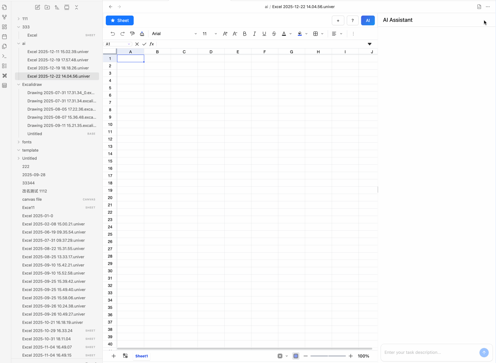

# Introduction

The AI Assistant can operate spreadsheets using natural language, such as inserting data, setting cell background colors, applying font styles, and generating formulas.

## Supported Tools

- `getSheetDataTool`: Get sheet data
- `insertSheetDataTool`: Insert sheet data
- `getSheetListTool`: Get sheet list
- `createSheetTool`: Create sheet
- `setFormulaTool`: Set formula
- `setRangeStyleTool`: Set cell style

More tools are under development...
