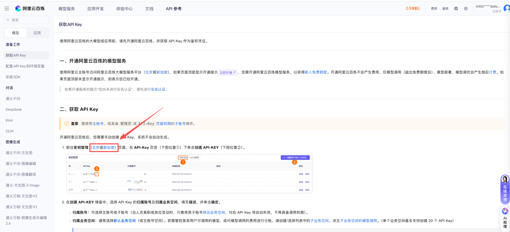
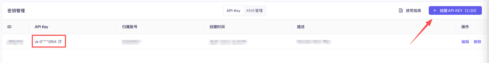
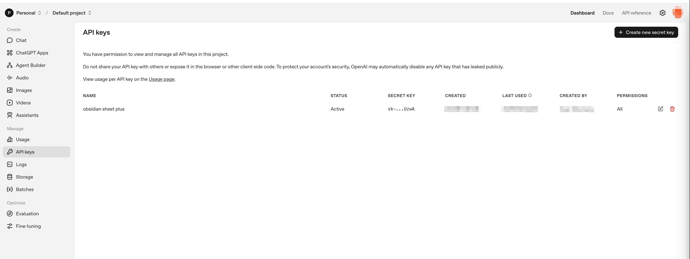
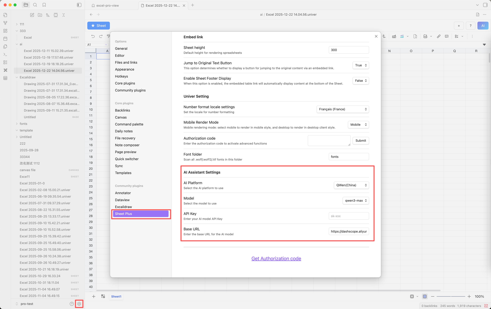

# Quick Start
::: note
- AI Assistant is a paid plugin feature; you need to purchase an activation code before use.
:::

## Get Your API Key
### Tongyi Qianwen
- Go to [Tongyi Qianwen](https://bailian.console.aliyun.com/?spm=5176.29619931.J_SEsSjsNv72yRuRFS2VknO.2.74cd10d721z1Wp&tab=api#/api/?type=model&url=2712195) to obtain your API Key.

- After registering your account, navigate to the page for creating an API Key.

::: note
- Users in China: click “Beijing” to proceed.
- Users outside China: click “Singapore” to proceed.
:::

- Create your API Key.

### OpenAI
- Go to [OpenAI](https://platform.openai.com/api-keys) to obtain your API Key; you must register an account first.

::: note
- Using AI Assistant requires calling the APIs of Tongyi Qianwen or OpenAI, which incurs costs paid directly to the respective service platforms and is separate from the plugin license fee.
- New accounts usually receive a free quota; please check the corresponding billing pages for details.
  - Tongyi Qianwen pricing: [Tongyi Qianwen Billing](https://help.aliyun.com/zh/model-studio/model-pricing?spm=a2c4g.11186623.help-menu-2400256.d_0_1_1.3adc7fc6ld6f4L&scm=20140722.H_2987148._.OR_help-T_cn~zh-V_1)
  - OpenAI pricing: [OpenAI Billing](https://platform.openai.com/docs/pricing)
:::

## Configure Your API Key

- `AI Platform`: Select the AI platform you registered with.
- `API Key`: Enter the API Key you obtained.
- `Model`: Choose the model you want to use; different models have different costs. Refer to the corresponding billing page and select a lower-cost model if desired.
- `Base URL`: The API endpoint; it will be updated automatically after selecting the platform and usually does not need manual modification.

::: warning
- This is an experimental feature; feedback is welcome and will be used for future improvements. You can provide feedback through:
  - Submit a [GitHub discussion](https://github.com/ljcoder2015/obsidian-sheet-plus/discussions/categories/ai-assistant)
  - Join the [Discord server](https://discord.gg/fufpbG4tJg) and share your thoughts in the #ai-assistant channel
  - Email: [ljcoder@163.com](mailto:ljcoder@163.com)
:::
