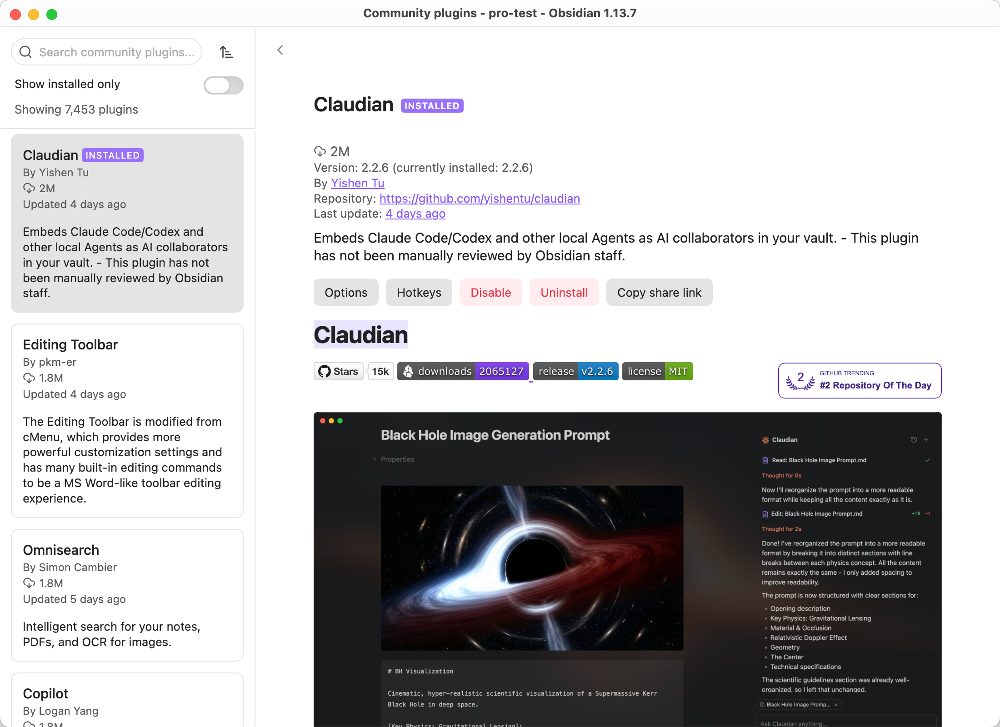
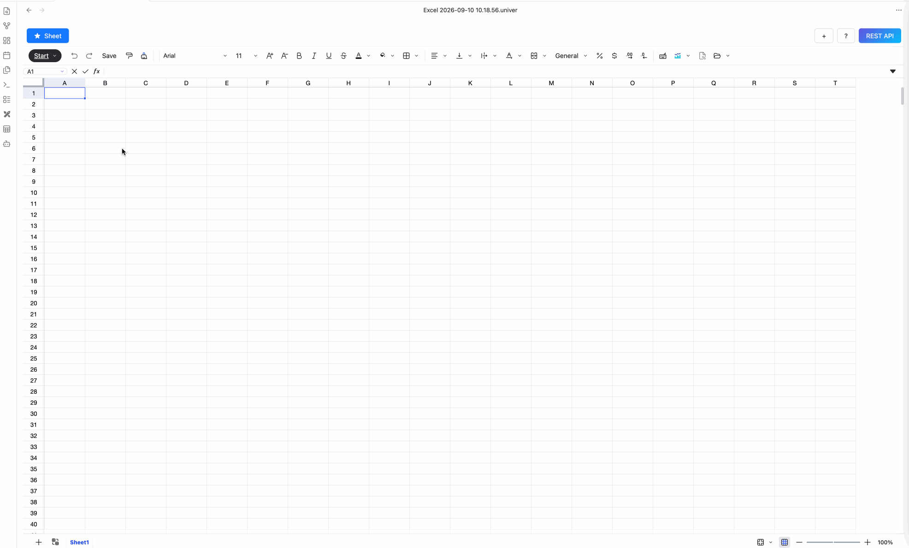
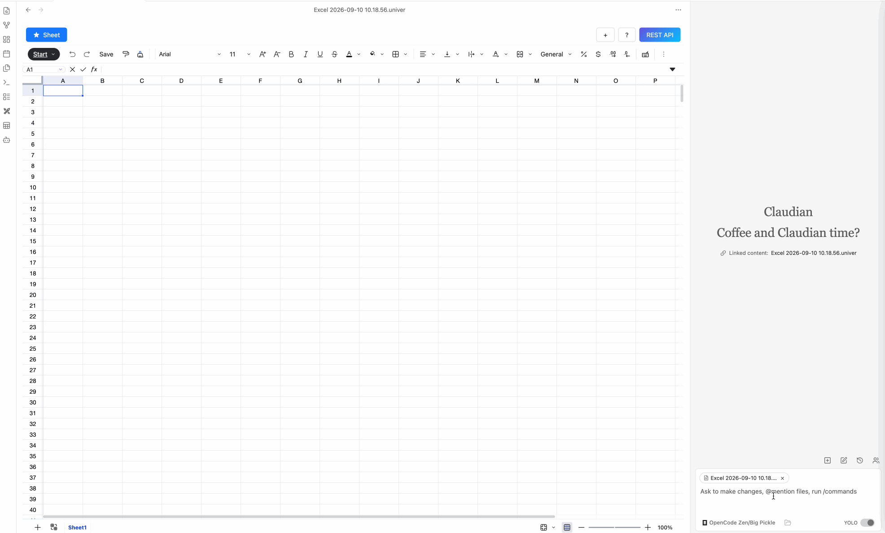
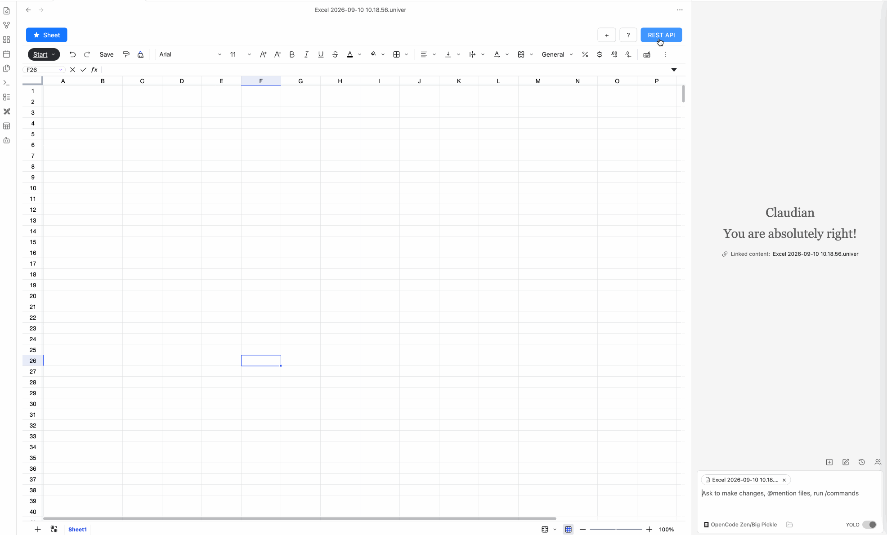

Install the Claudian plugin to automate spreadsheet data processing with the Sheet Plus REST API.

::: video youtube
PgEjAyLLTTM
:::

## Install the Claudian Plugin

Install the Claudian plugin in Obsidian.



## Open Claudian

Open the Claudian panel from the sidebar.



## Install the Obsidian Sheet Plus Skill

::: tip Skill Sources
- Github: [https://github.com/ljcoder2015/obsidian-sheet-plus-skill](https://github.com/ljcoder2015/obsidian-sheet-plus-skill)
- Clawhub: [https://clawhub.ai/ljcoder2015/skills/obsidian-sheet-plus-skill](https://clawhub.ai/ljcoder2015/skills/obsidian-sheet-plus-skill)
:::

Enter the following prompt to install the `obsidian-sheet-plus` skill:

```text
https://github.com/ljcoder2015/obsidian-sheet-plus-skill install this skill globally
```


## Automate Spreadsheet Data Processing

Once the `obsidian-sheet-plus` skill is installed, you can use it in Claudian to automate spreadsheet data processing.

First, start the REST API service.

The prompt below is an example of automating spreadsheet data processing with the `obsidian-sheet-plus` skill. For the first task, include the REST API service API Key in the prompt.

```text
Set the API Key to: <your_api_key>
Get Apple's stock prices for the last month and insert them into the sheet.
```


