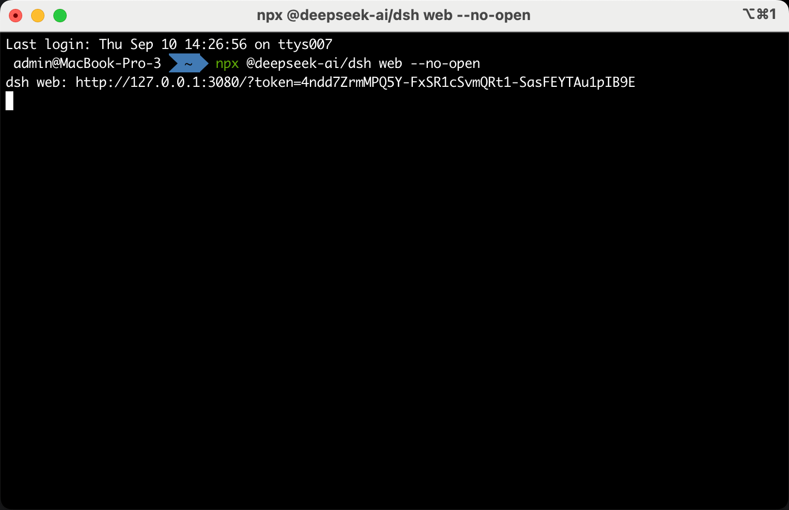
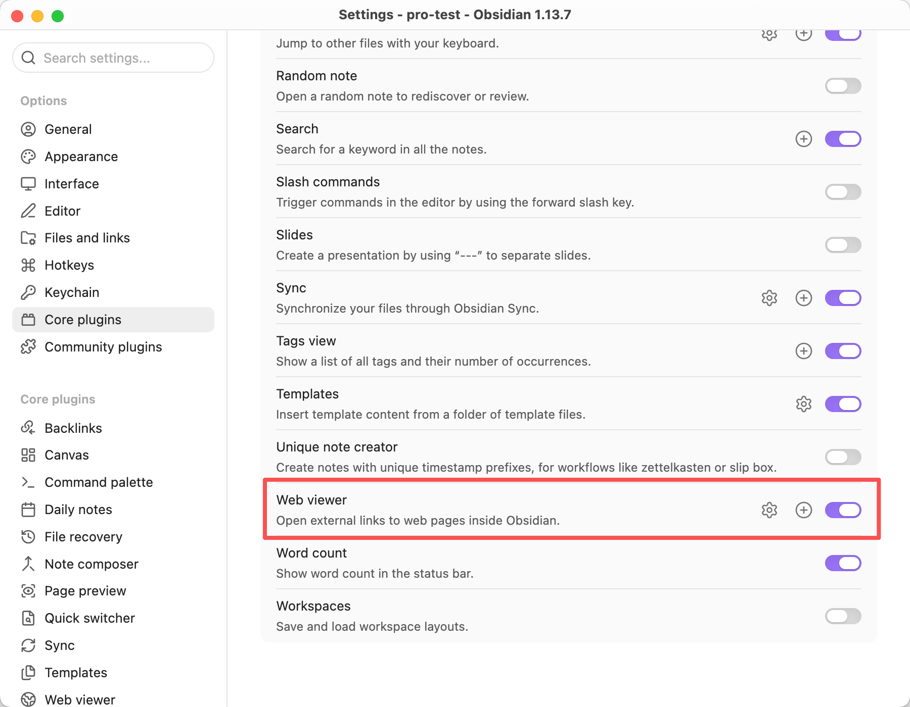
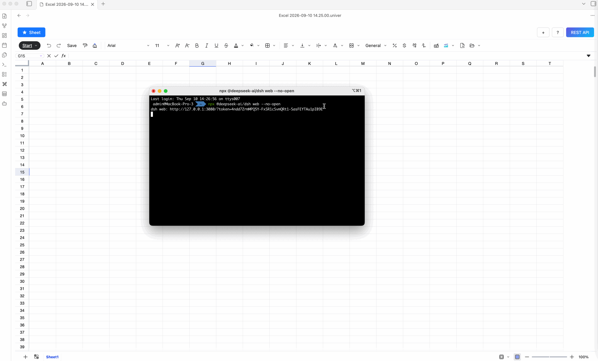
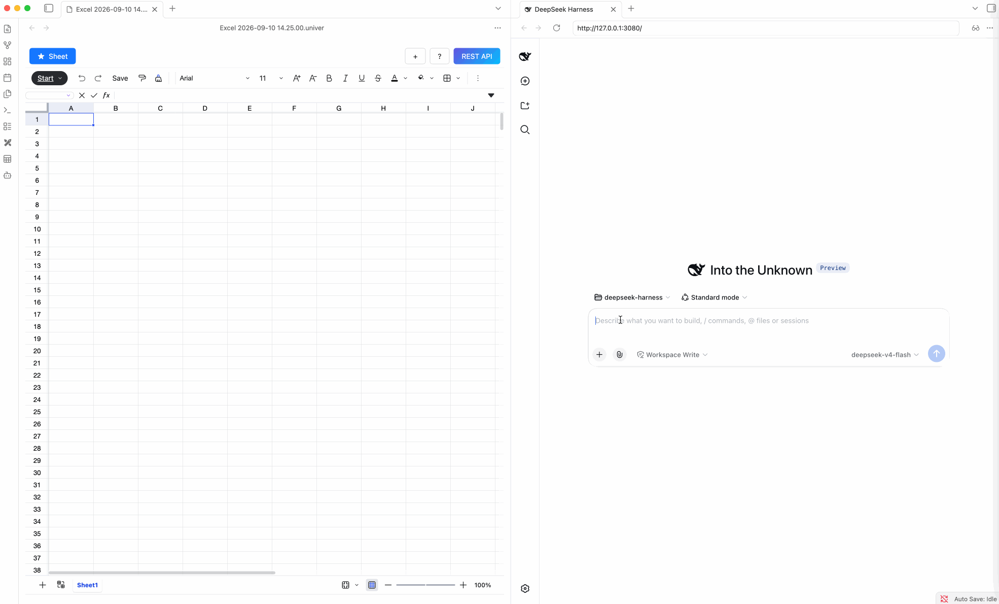
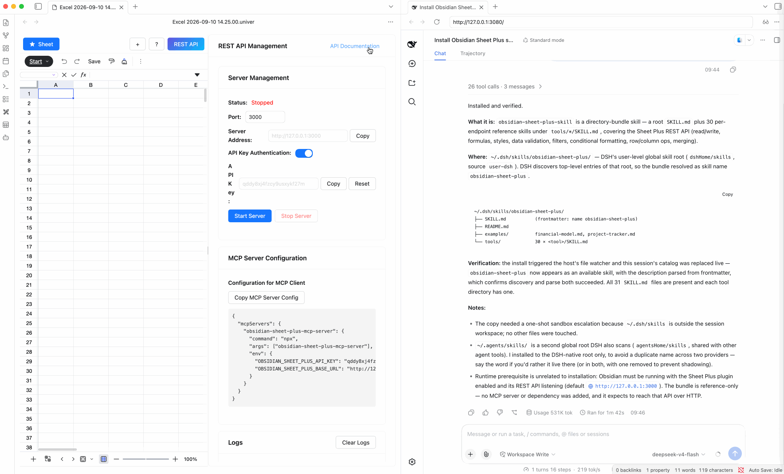

Run the DeepSeek Harness web UI inside Obsidian's webView to automate spreadsheet data processing with the Sheet Plus REST API.

## Start DeepSeek Harness

```bash
npx @deepseek-ai/dsh web --no-open
```

::: warning
The `--no-open` flag is required so that DeepSeek Harness can be opened in Obsidian's webView.
:::

After running the command, the terminal prints logs similar to the following:

```text
dsh web: http://127.0.0.1:3080/?token=e0Kuxe1TDopVe3BIShG6v06lKTAhWs_LN9sYmfNl3Z8
```



## Open DeepSeek Harness in Obsidian webView

Enable the webView feature in the core plugins.



Then copy the URL from the terminal output and open it in the webView.



## Install the Obsidian Sheet Plus Skill

::: tip Skill Sources
- Github: [https://github.com/ljcoder2015/obsidian-sheet-plus-skill](https://github.com/ljcoder2015/obsidian-sheet-plus-skill)
- Clawhub: [https://clawhub.ai/ljcoder2015/skills/obsidian-sheet-plus-skill](https://clawhub.ai/ljcoder2015/skills/obsidian-sheet-plus-skill)
:::

Enter the following prompt to install the `obsidian-sheet-plus` skill:

```text
https://github.com/ljcoder2015/obsidian-sheet-plus-skill install this skill globally
```



## Automate Spreadsheet Data Processing

Once the `obsidian-sheet-plus` skill is installed, you can use it in DeepSeek Harness to automate spreadsheet data processing.

First, start the REST API service.

The prompt below is an example of automating spreadsheet data processing with the `obsidian-sheet-plus` skill. For the first task, include the REST API service API Key in the prompt.

```text
Set the API Key to: <your_api_key>
Get Apple's stock prices for the last month and insert them into the sheet.
```


