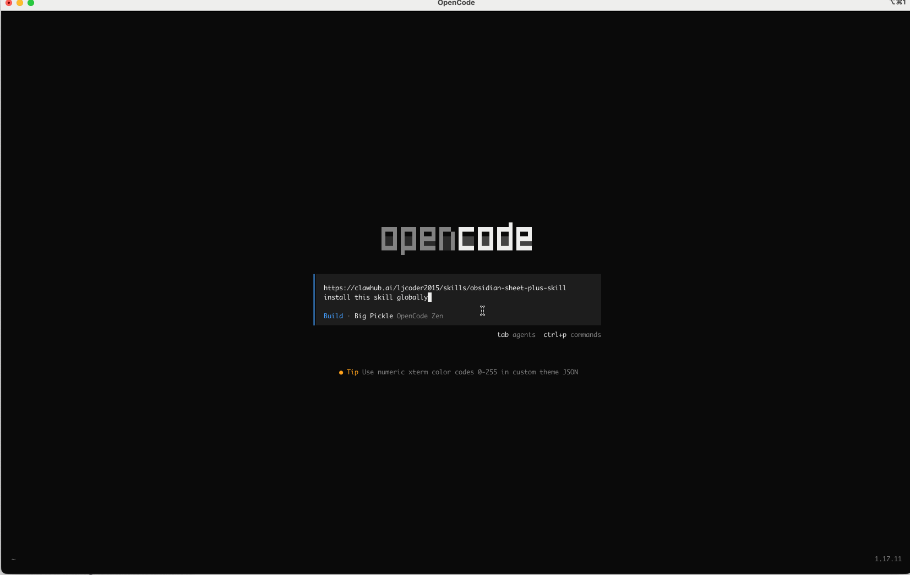

## Installing Obsidian Sheet Plus Skill

> Github: [https://github.com/ljcoder2015/obsidian-sheet-plus-skill](https://github.com/ljcoder2015/obsidian-sheet-plus-skill)
>
> Clawhub: [https://clawhub.ai/ljcoder2015/skills/obsidian-sheet-plus-skill](https://clawhub.ai/ljcoder2015/skills/obsidian-sheet-plus-skill)

Enter the following prompt in OpenCode to automatically install the skill globally (so it is available in all your projects):

```text
https://clawhub.ai/ljcoder2015/skills/obsidian-sheet-plus-skill install this skill globally
```


 
## How to Use

After installation, you need to restart OpenCode to use the skill.
Type `/skills` to see that the `obsidian-sheet-plus` skill appears in the installed skills.

Here is an example of using the `obsidian-sheet-plus` skill to fetch today's stock prices.

First, create a new sheet in Obsidian and start the REST API service.

Enter the following prompt:
```
Get today's U.S. stock prices and insert them into the sheet.
```

OpenCode will first check the REST API service status and whether authorization is required. If authorization is needed, it will prompt you to enter the API Key.
Once connected, it will query today's stock prices and then call the `obsidian-sheet-plus` skill to insert them into the sheet.


