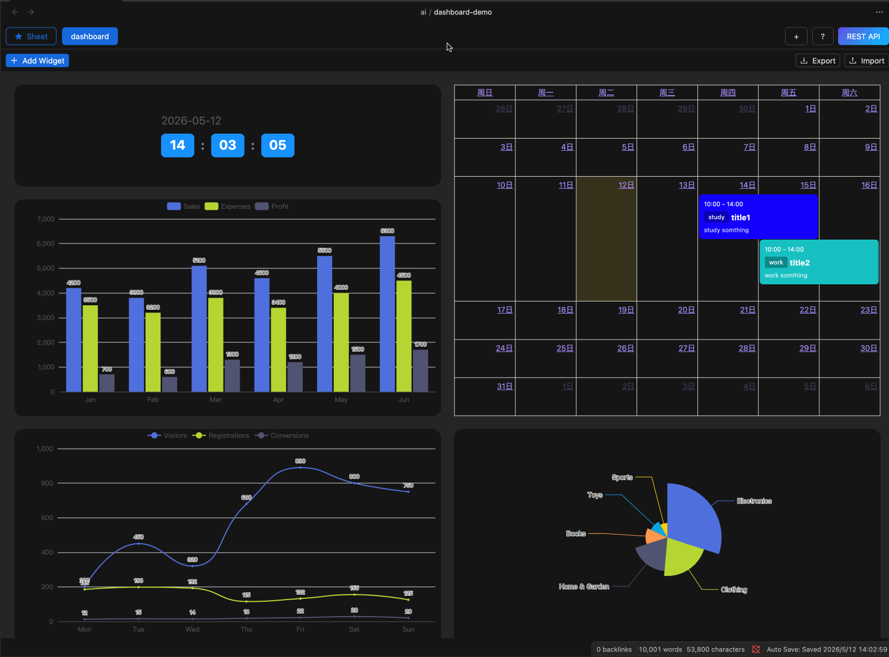

# Introduction

## What is a Dashboard?

A dashboard is a visual representation of data that allows you to analyze it.

## Supported Components

- Time Component
  - Display current time
  - Countdown
- Calendar Component
- Chart Component
  - Bar
  - Line
  - Pie
  - Candlestick
  - TreeMap
  - Funnel
  - Word Cloud
  - Stage

## Demo

<Download href="https://github.com/ljcoder2015/obsidian-sheet-plus-document/blob/main/docs/guide/Advanced%20Features/Dashboard/dashboard-demo.md.zip" />
<Download href="dashboard-demo.md.zip" />

Download the `dashboard-demo` file and drag it into Obsidian to view it.
