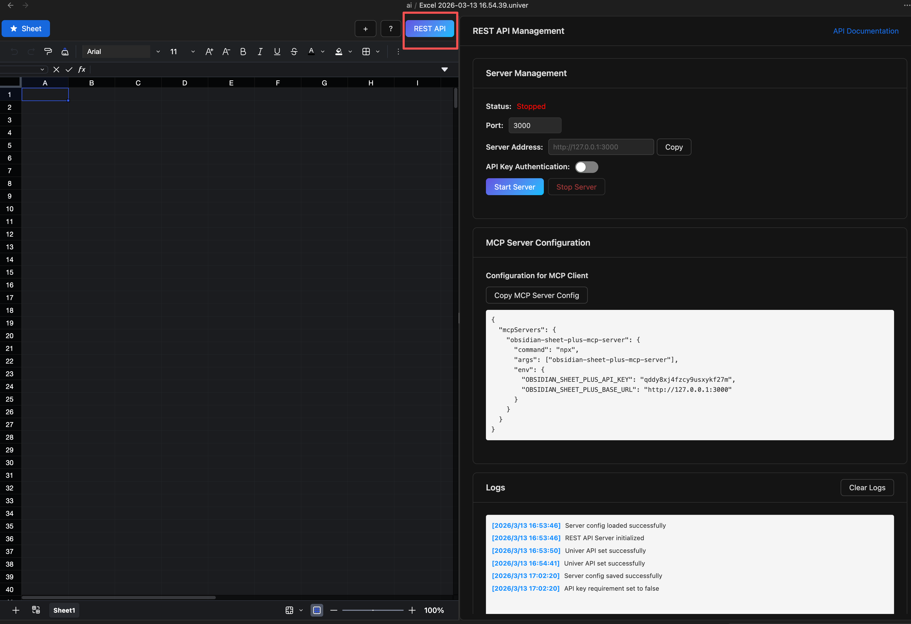
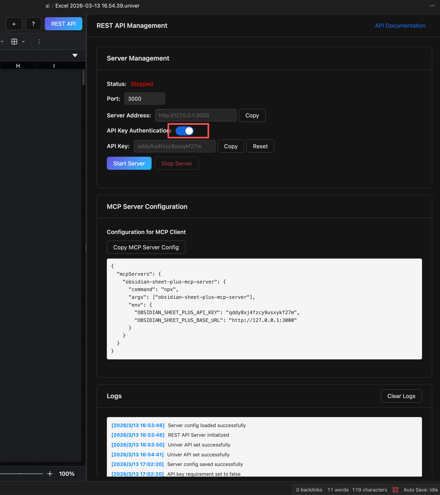
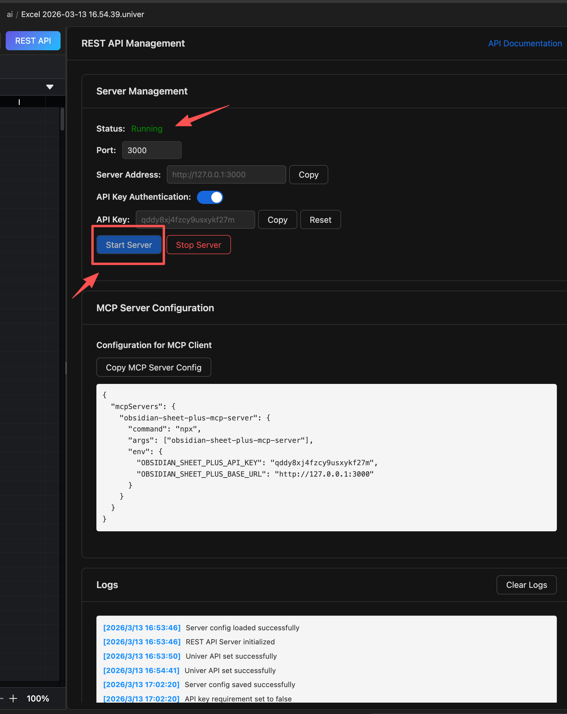
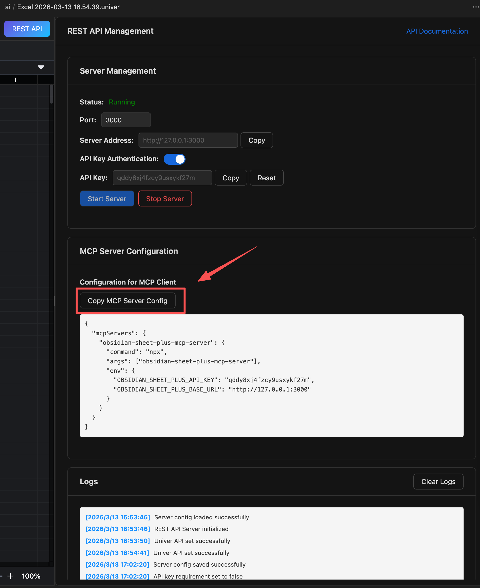

# Quick Start

## What is the REST API?

After starting the REST API service, you can call tools in LLM clients (such as Claude, OpenClaw, etc.) to automatically process sheet data.

## Obsidian Sheet Plus Skill

If you don't want to call the REST API through the MCP Server, you can use the `obsidian-sheet-plus` skill directly in your LLM client.

For usage instructions, please jump to the [Skill](/guide/rest-api/skill) page.

---
::: video youtube
CHc6i6FEtxQ
:::

## How to Use Claude for Automated Data Processing

- Open the REST API configuration page

- Enable API Key authorization

- Start the REST API service

- Configure Claude
  1. Open the **Claude Desktop** application
  2. Open the **Settings** menu
  3. Go to the **Developer** tab in the settings page
  4. Click **Config** to configure the MCP Server
  5. In the REST API management page, click **Copy MCP Server Config**, then paste the configuration into the config file

  
  
  6. Restart Claude Desktop. You should see that the configuration has taken effect in the chat interface
  7. In the chat, enter the data you want to insert — Claude will automatically call the REST API to insert it
  8. The first time you use it, you’ll need to approve the MCP Server request. Click **Allow** to continue
