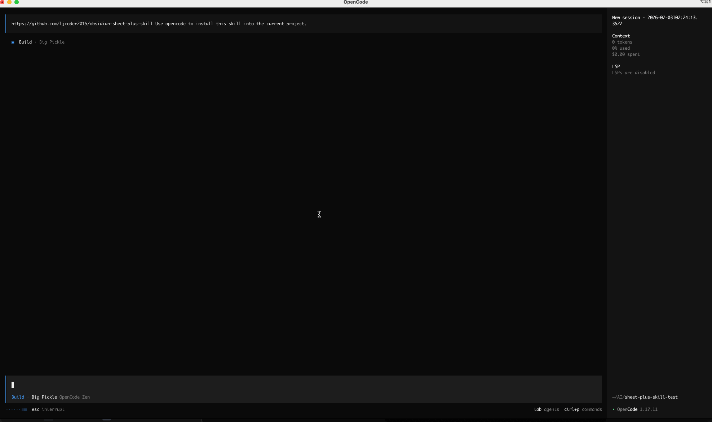
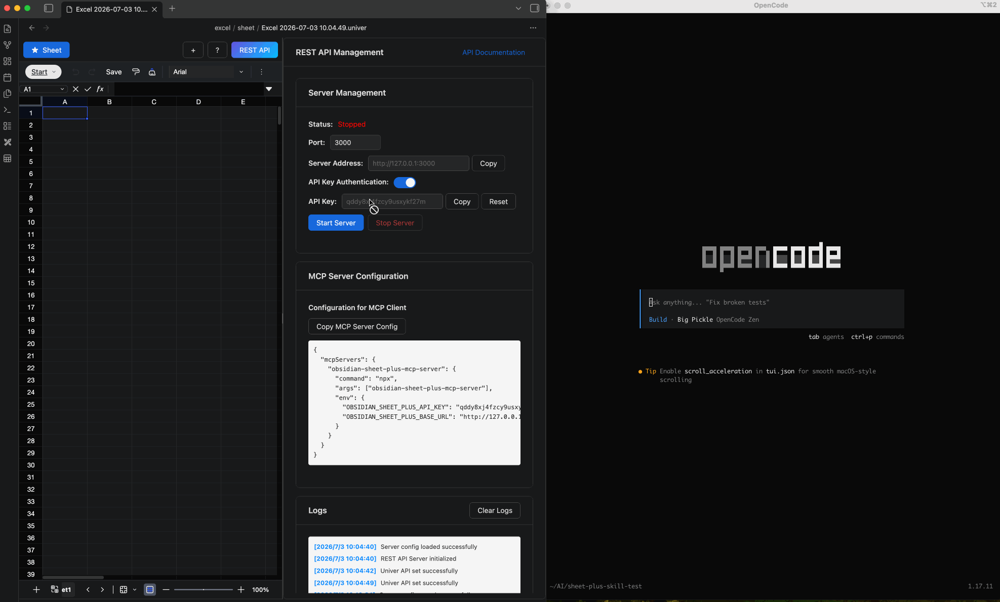

# Obsidian Sheet Plus Skill

::: tip
Skill does not depend on MCP Server.
You can use it in LLM clients (such as Claude, OpenClaw, OpenCode, etc.) directly.
You only need to install the skill in OpenCode.
:::

With this skill, you can manipulate spreadsheet data created by the Obsidian Sheet Plus plugin in LLM clients (such as Claude, OpenClaw, OpenCode, etc.).

## Installing the Skill

Taking OpenCode as an example, simply enter the following prompt to install the skill:

```
https://github.com/ljcoder2015/obsidian-sheet-plus-skill Use opencode to install this skill into the current project.
```



## How to Use

After installation, you need to restart OpenCode to use the skill.
Type `/skills` to see that the `obsidian-sheet-plus` skill appears in the installed skills.

Here is an example of using the `obsidian-sheet-plus` skill to fetch today's stock prices.

First, create a new sheet in Obsidian and start the REST API service.

Enter the following prompt:
```
Get today's U.S. stock prices and insert them into the sheet.
```

OpenCode will first check the REST API service status and whether authorization is required. If authorization is needed, it will prompt you to enter the API Key.
Once connected, it will query today's stock prices and then call the `obsidian-sheet-plus` skill to insert them into the sheet.


