# Calendar <Badge text="License Required" type="warning" />

::: warning License Required
Calendar features are **available only after license activation**.
:::

## settings
1. The table data must meet certain requirements:
   - The first row must contain field names.
   - Must have title, start time and end time columns.

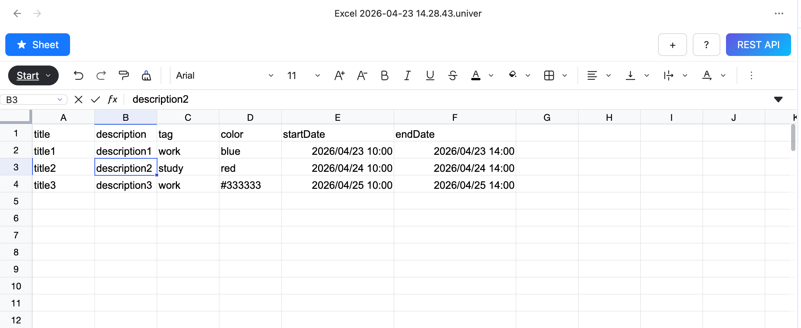

2. Click the plus button and choose “Add Calendar View”.

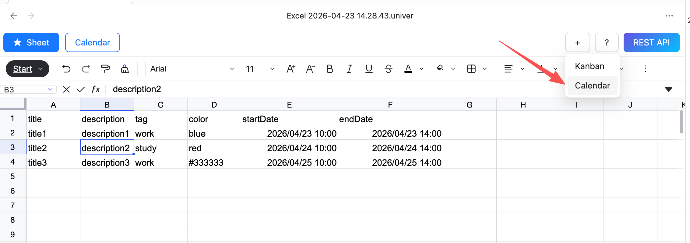

3. Switch to Calendar view, click Calendar Settings to open the settings dialog.

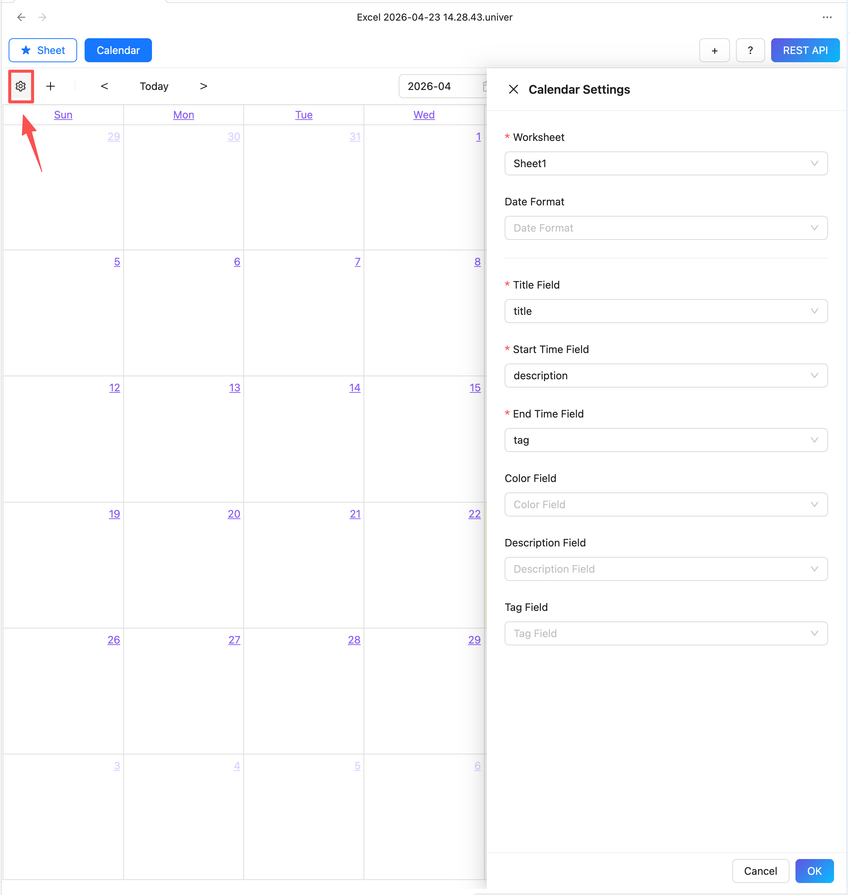

4. Configure the data source, fields

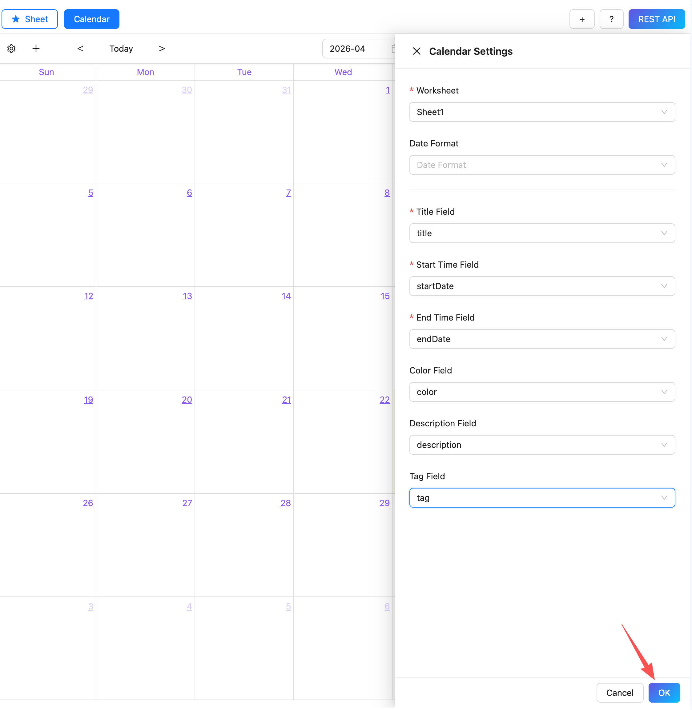

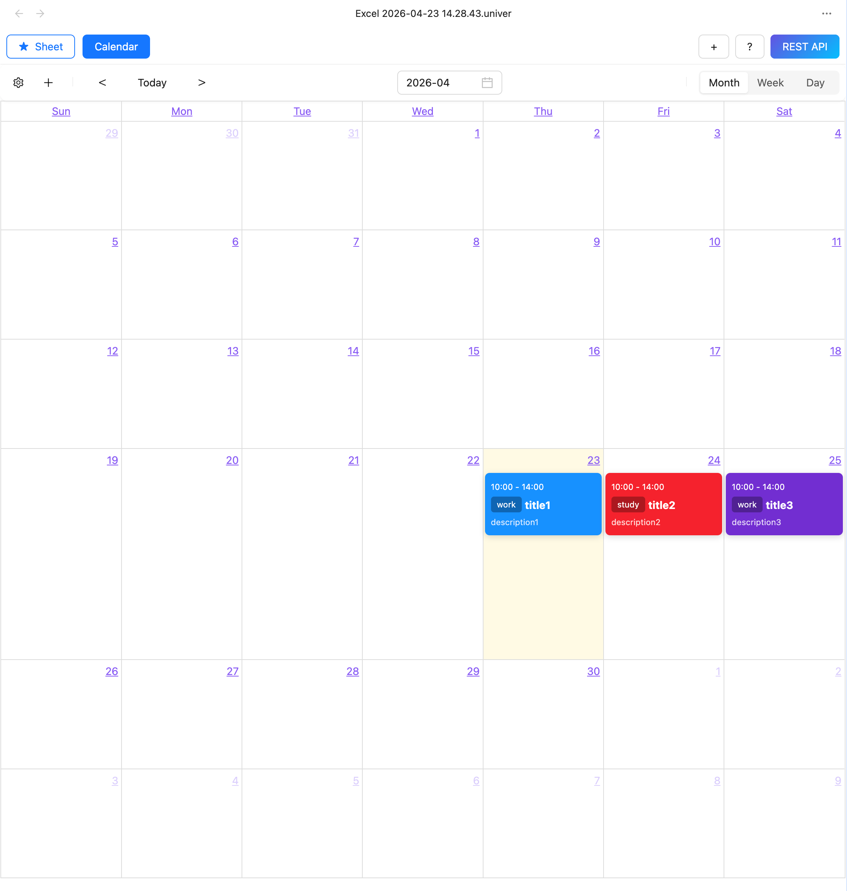

## Create Event
Click the "+" button to create an event. Or click on a time slot in the calendar view to create an event.

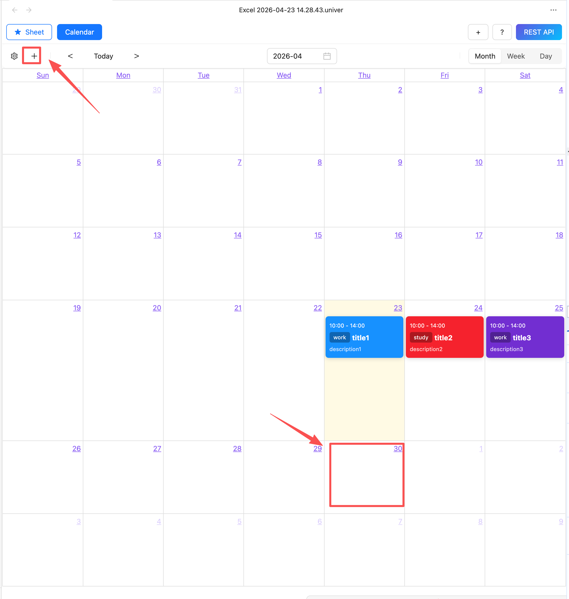

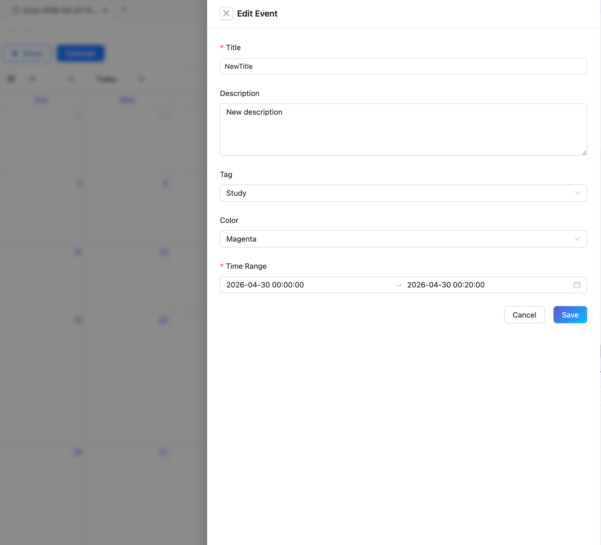

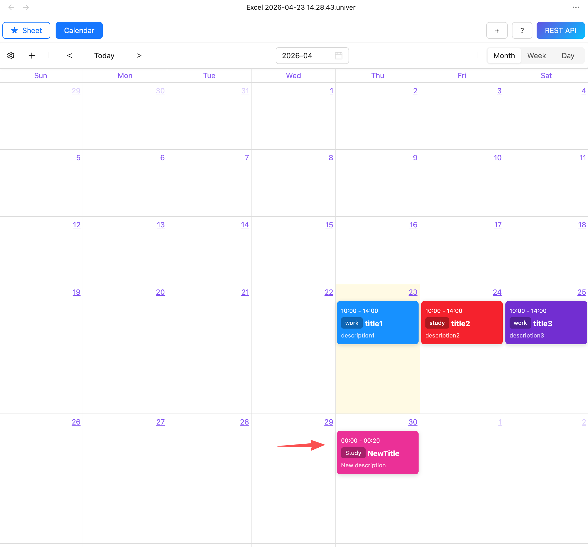

## Edit Event

Click on an event to edit it.

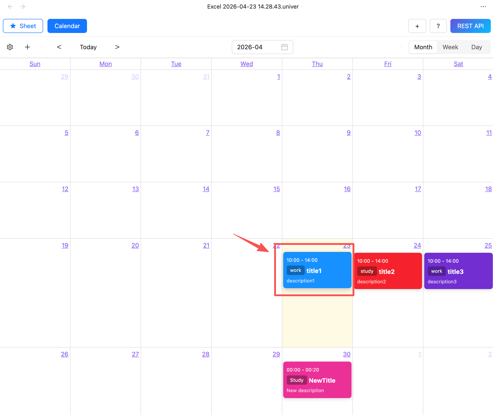

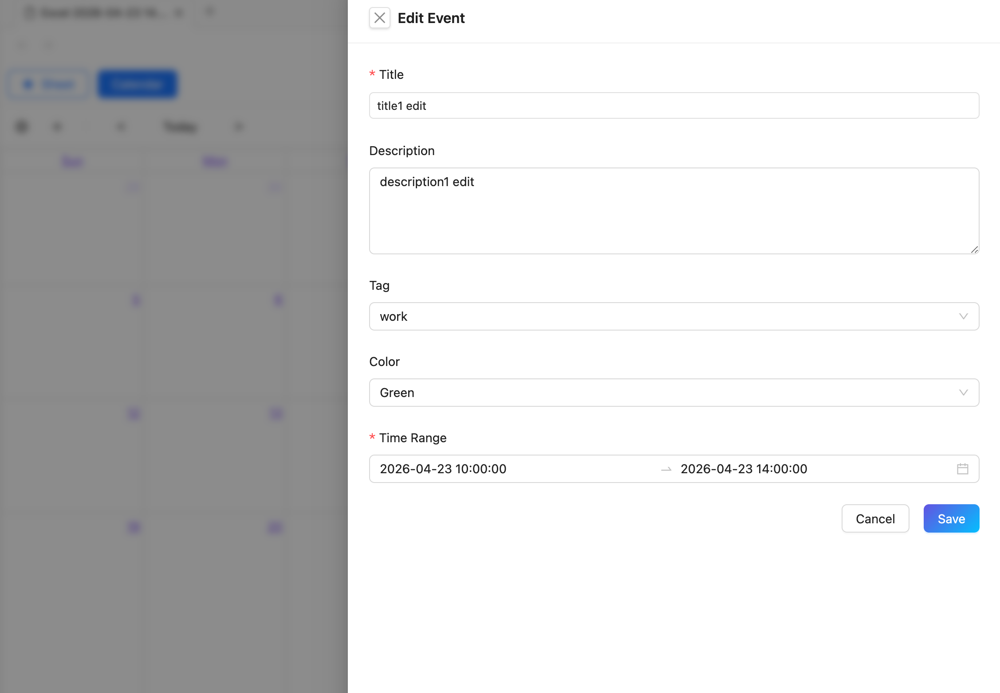

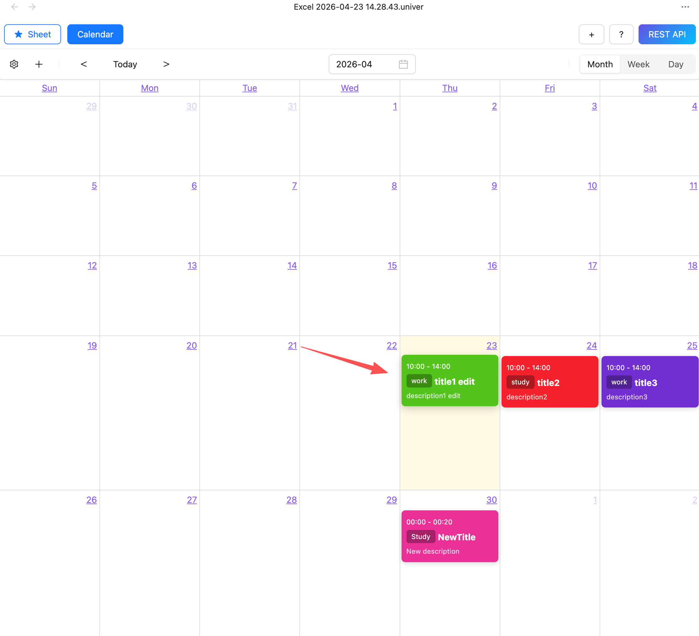