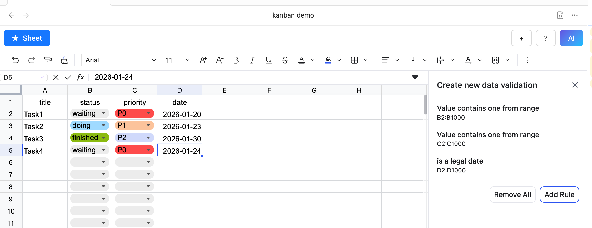
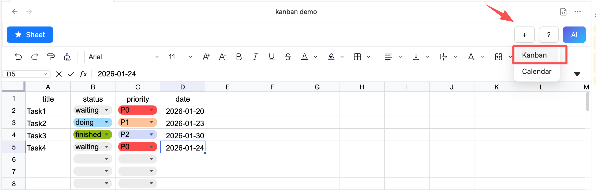
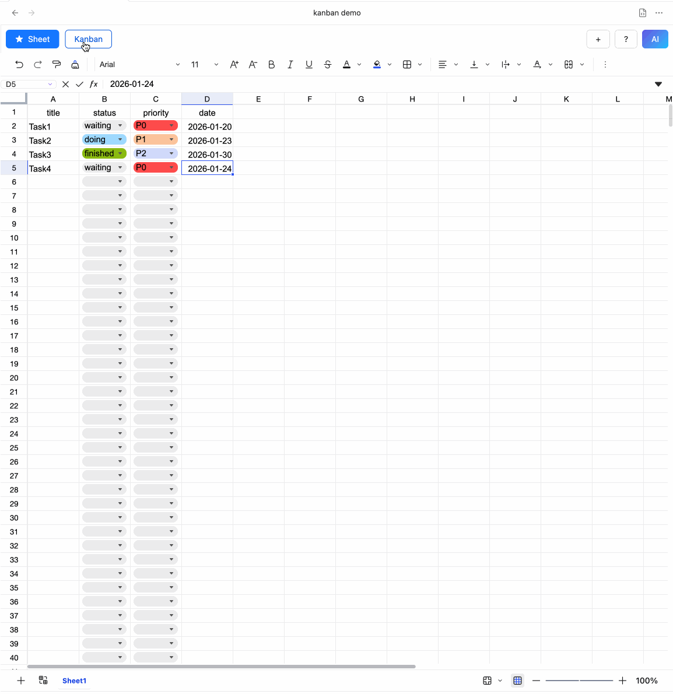
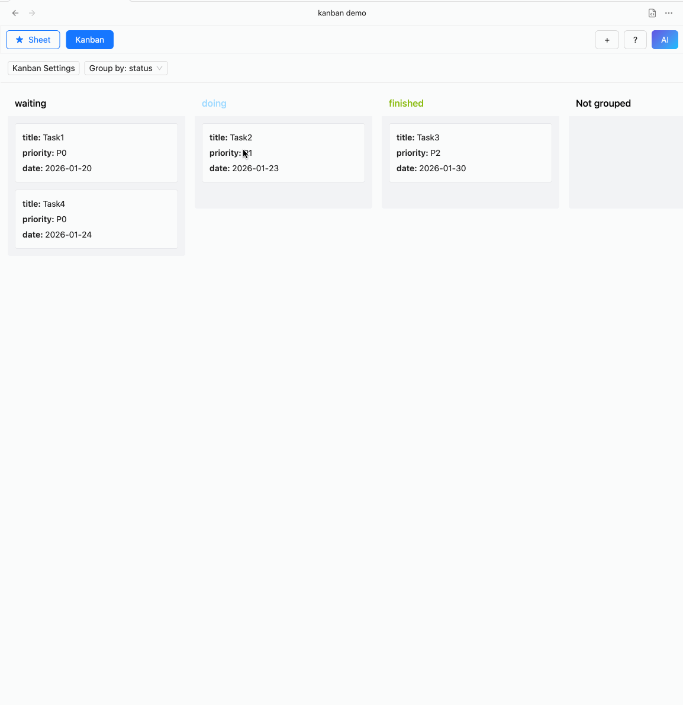

# Kanban <Badge text="License Required" type="warning" />

::: warning License Required
Kanban features are **available only after license activation**.
:::

Kanban view can display table data in Kanban mode, grouping data according to a specified field for easier viewing and management.

## Creating a Kanban
1. The table data must meet certain requirements:
   - The first row must contain field names.
   - One column must serve as the grouping field; set a drop-down list in data validation to designate this column.

2. Click the plus button and choose “Add Kanban View”.

3. Switch to Kanban view, click Kanban Settings to open the settings dialog. Configure the data source, range, fields, etc.
4. Set the grouping field.

## Change Data via Drag-and-Drop
Dragging cards in the Kanban will automatically update the corresponding data in the sheet.

