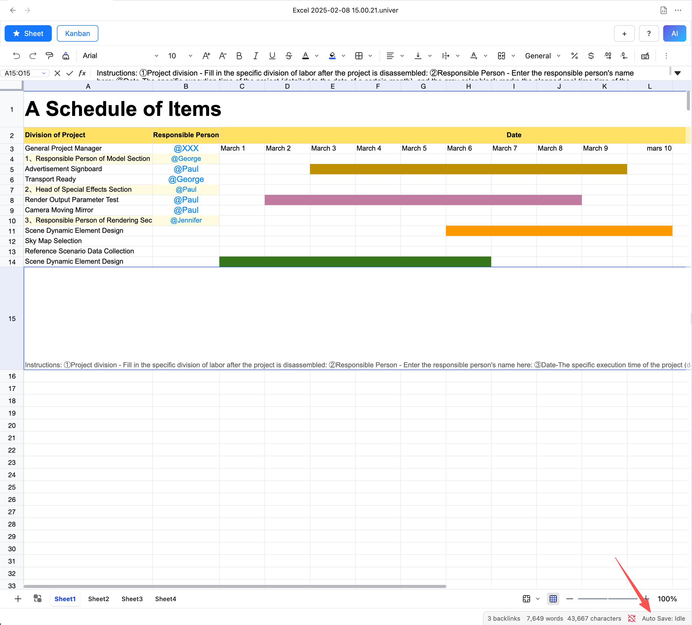
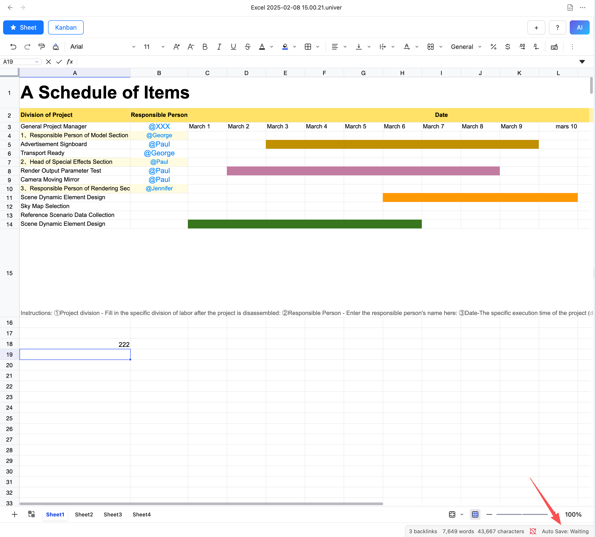
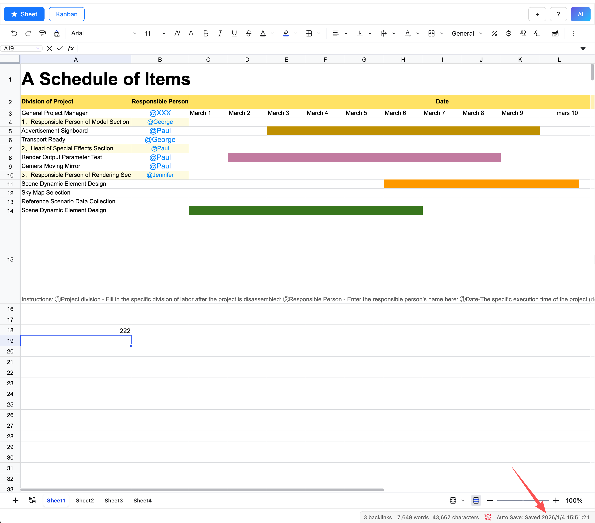

# Auto Save
After a table is modified, the data is not saved to the file immediately; instead, it is automatically saved every 30 seconds. You can check the save status in the status bar at the bottom.

- Idle: The table has not been modified and is not saved.

- Pending save: The table has been modified and will be saved after 30 seconds.

- Save successful: The table has been successfully saved, and the time of the last save is displayed.

::: note
When a file is opened for the first time, auto-save is triggered. If the file has not been modified and is deemed not needing to be saved, it will switch to the idle state.
:::
