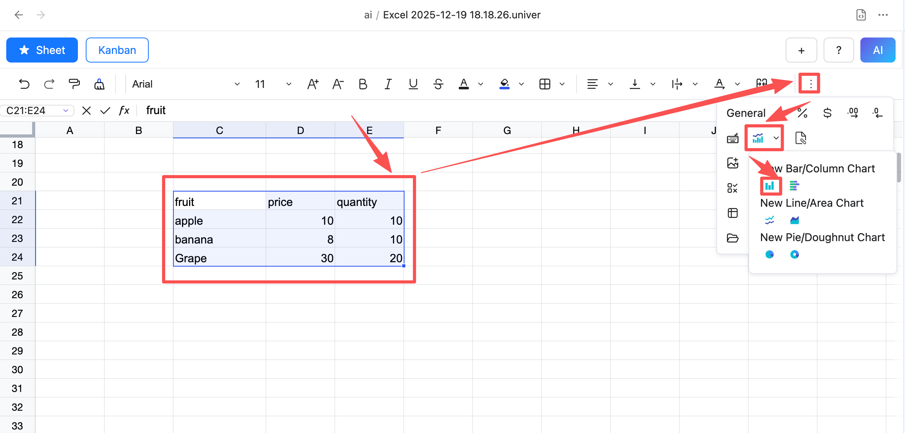
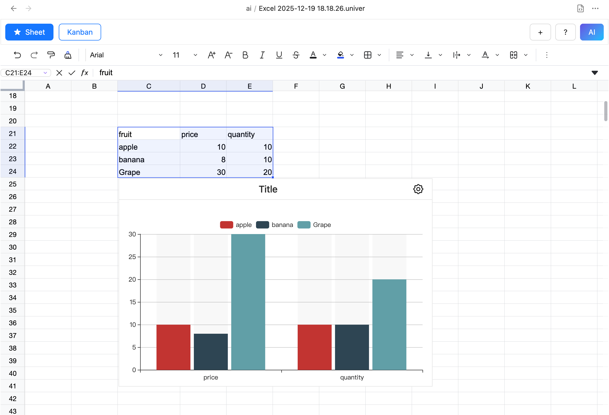
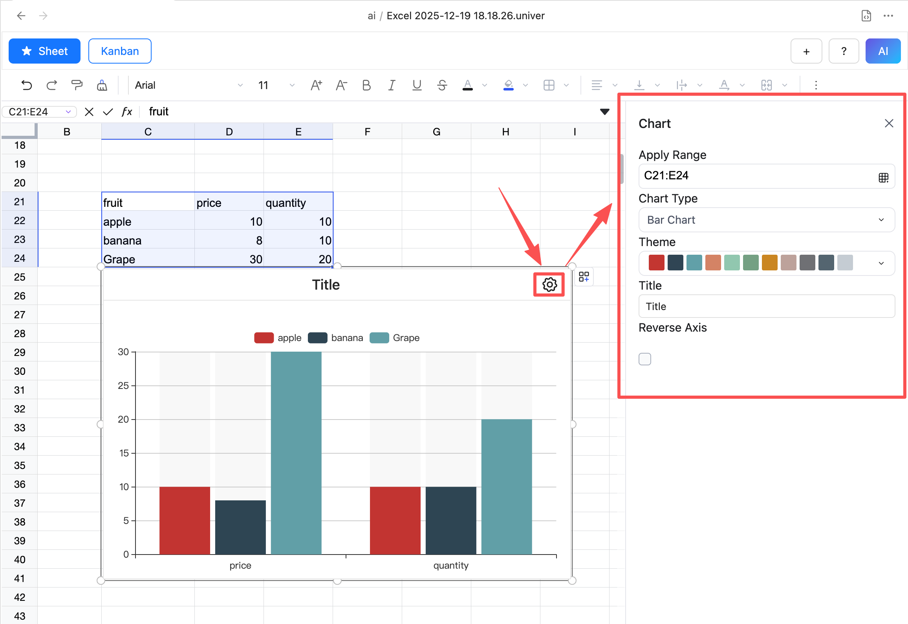
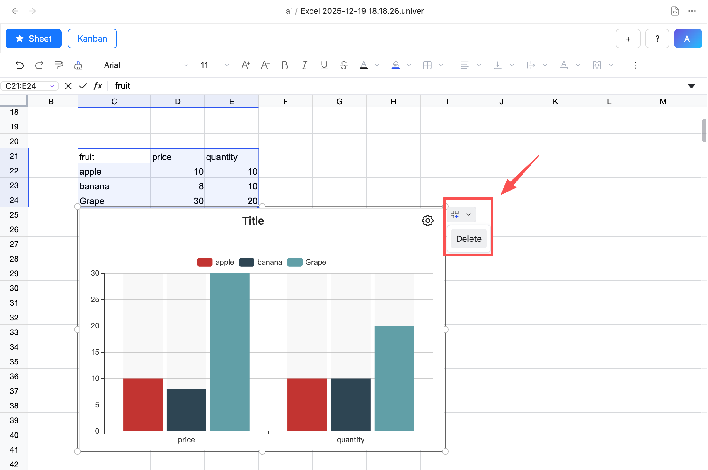

# Charts

## Insert Chart

1. Select the data you want to insert as a chart
2. Click the Insert Chart button in the toolbar and choose the chart type you want to insert

3. After clicking OK, the chart is inserted into the spreadsheet

## Chart Settings

1. Select the inserted chart
2. Click the Chart Settings button to open the Chart Settings dialog
3. In the dialog, you can set the chart title, type, style, etc.

## Delete Chart

1. Select the chart you want to delete
2. Click the Delete button, and the chart will be deleted

