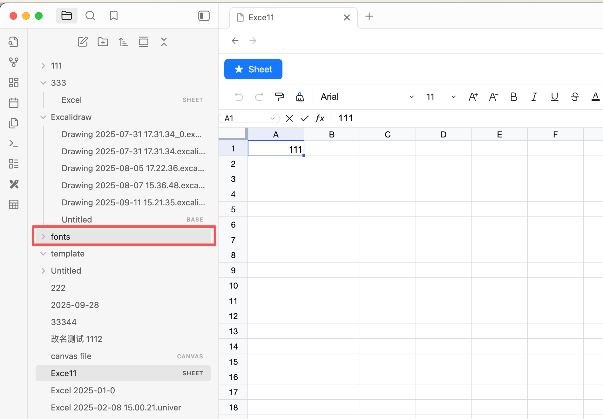
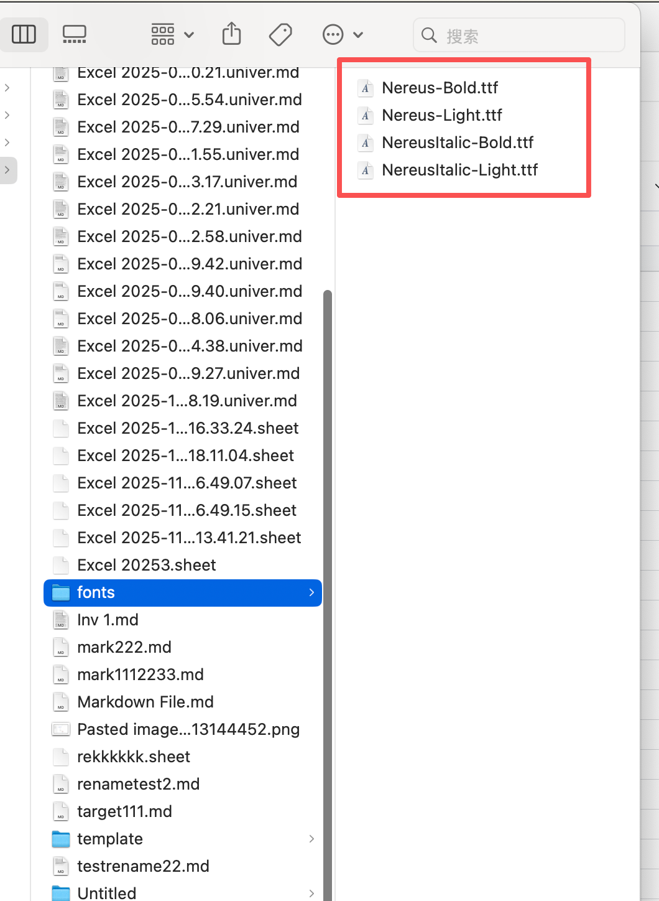
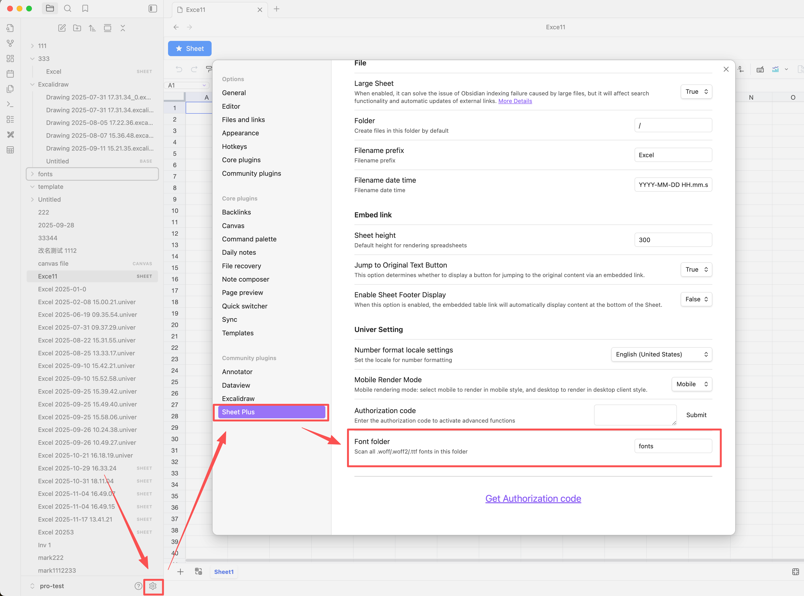

# Custom Font

## Setting the Font Directory

- Create a font directory, for example `fonts`

- Place the font files into the font directory

::: tip
- Supports .woff/.woff2/.ttf font file formats
- Font files will not be displayed in Obsidian; you need to check the folder to see if the fonts have been added
- After setup, restart Obsidian for the changes to take effect
:::

- Set the font directory in the settings page

## Setting the Font

- Set the font in the sheet

