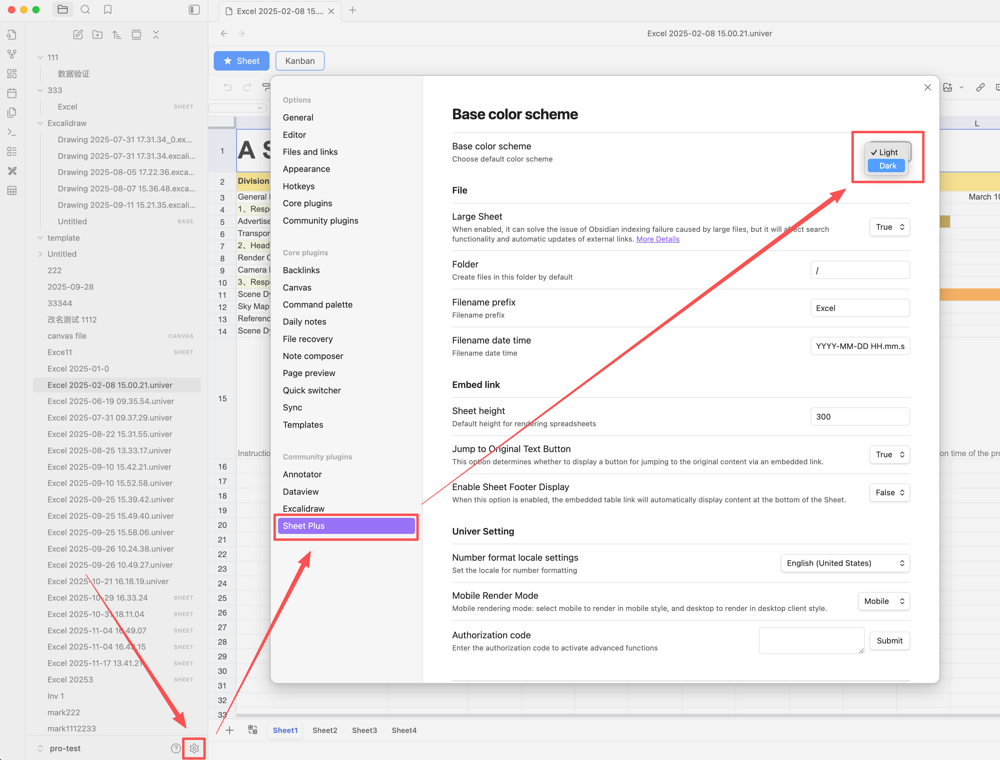

# Dark Mode

Dark Mode does not follow Obsidian’s theme settings. You need to configure it manually in the Settings panel, and the file must be reopened for the changes to take effect.

## Dark Mode Settings
- Open Obsidian settings
- Locate **Sheet Plus** plugin settings
- Change the base color scheme to **Dark**
- Reopen the file for the changes to take effect

