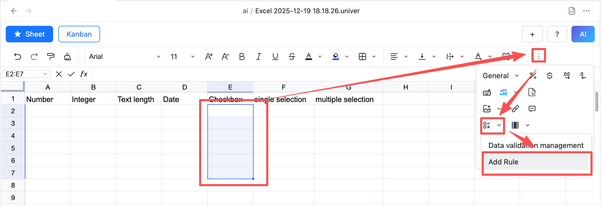
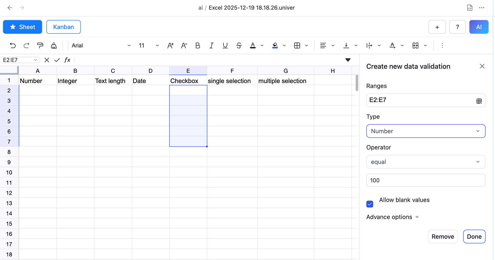
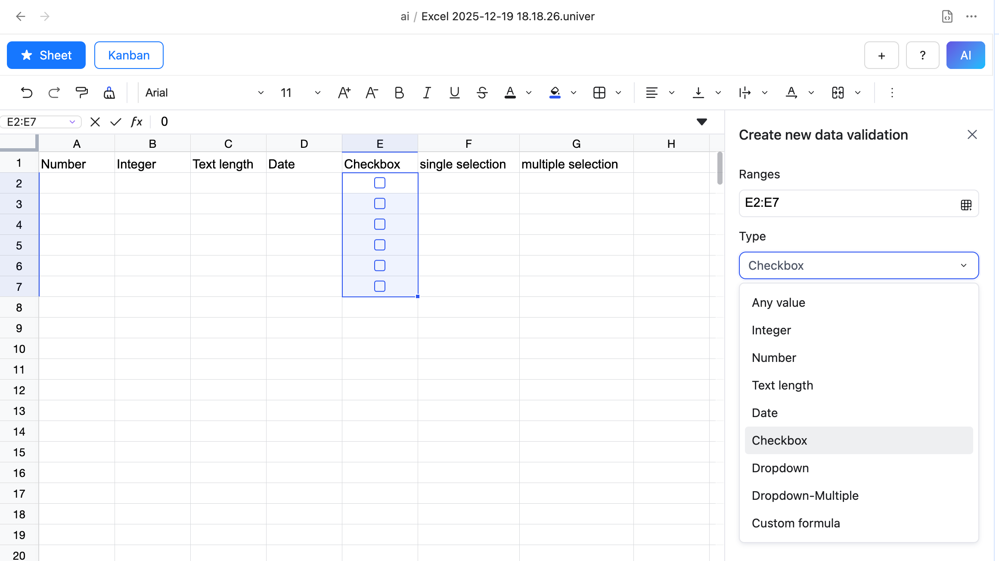
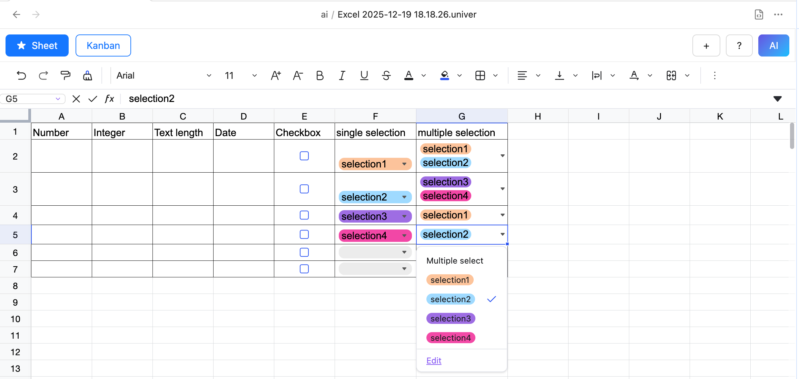

# Data Validation

## What is Data Validation?
Data validation is a feature that allows you to set rules in cells to ensure that the data entered meets specific requirements. It helps users avoid input errors and improves the accuracy and consistency of data.

Currently, the following data validation types are supported:

- Number
- Integer
- Text length
- Date
- Checkbox
- Dropdown list (single/multiple selection)
- Custom formula

## How to use Data Validation?

1. Select the cell or range of cells where you want to apply data validation.
2. Click the Data Validation button in the toolbar.

3. In the Data Validation dialog, select the desired validation type from the "Validation type" dropdown.

4. Set the validation criteria and rules in the corresponding fields.

5. Click OK to apply the data validation.

