## Image

Insert images from outside the current Obsidian vault

### Floating Image

1. Click the Insert Image button in the toolbar and choose "Float Image" from the pop-up menu.

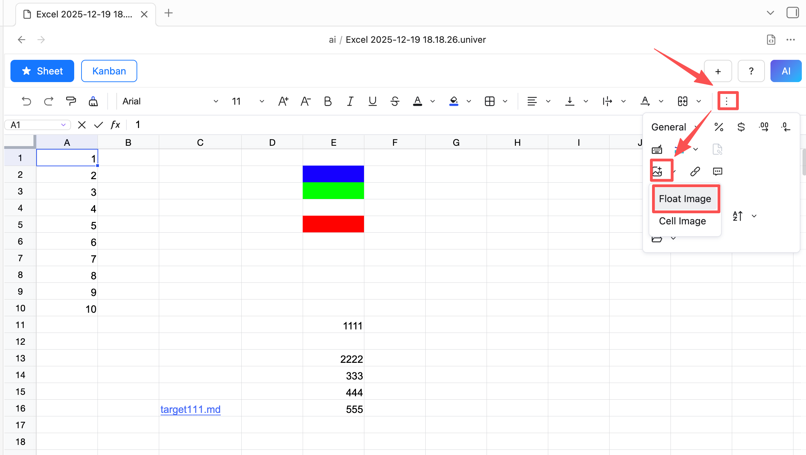

2. In the dialog that appears, select the image file you want to insert. After clicking OK, the image is inserted into the table.

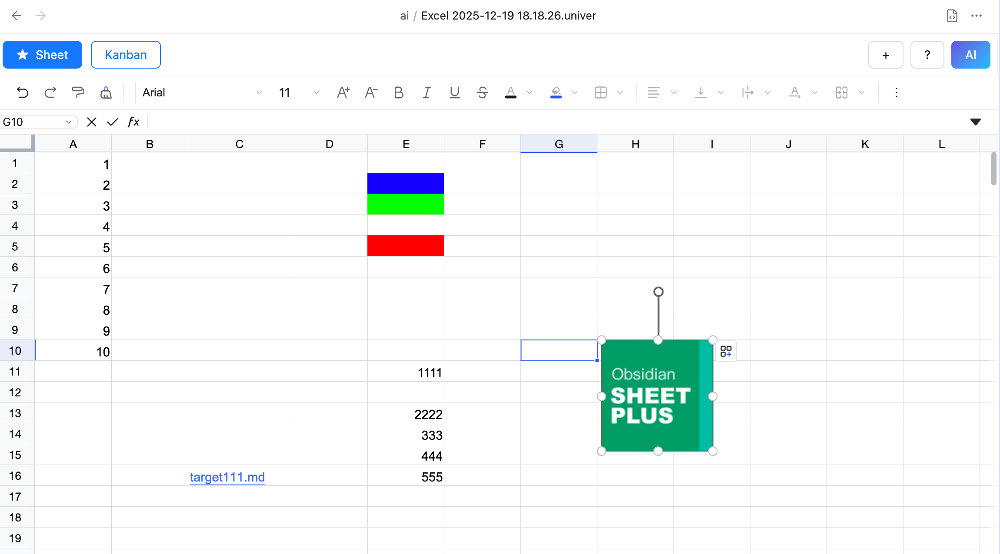

### Cell Image

1. Select the cell where you want to insert the image.
2. Click the Insert Image button in the toolbar and choose "Cell Image" from the pop-up menu.

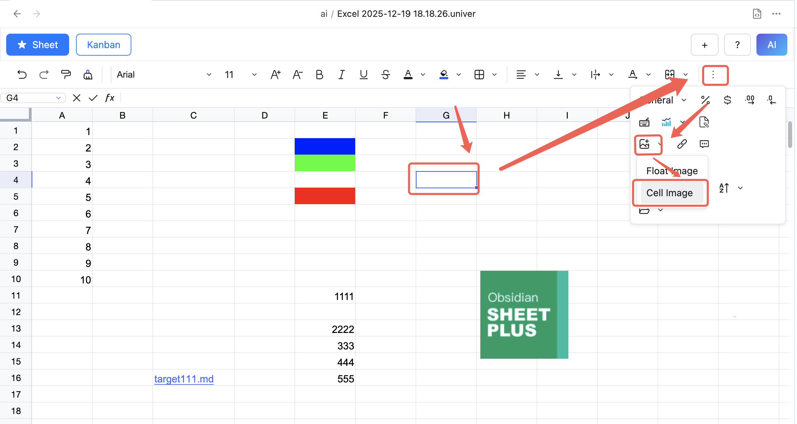

3. In the dialog that appears, select the image file you want to insert. After clicking OK, the image is inserted into the cell.

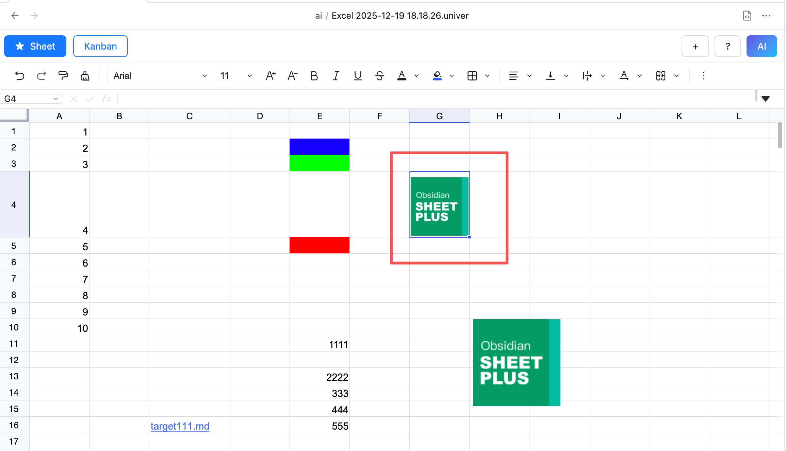

## Local Image

Insert images from within the Obsidian vault, supporting batch insertion of multiple images

### Batch Insert Floating Images

Click the Insert Floating Image button, select multiple image files, and click the OK button to batch insert multiple floating images into the current column

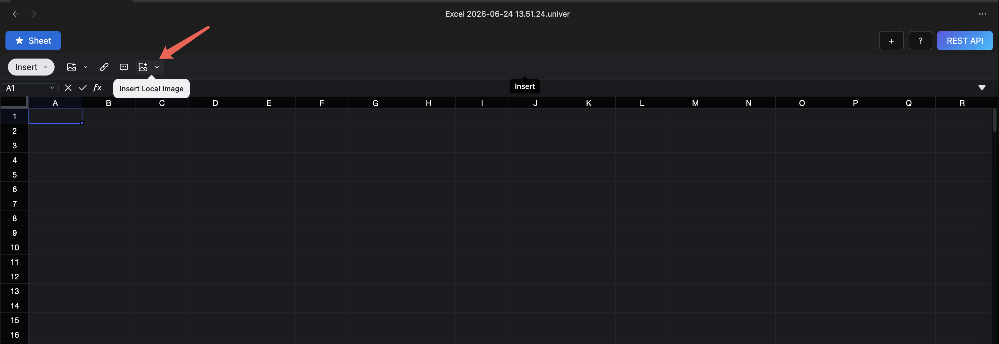

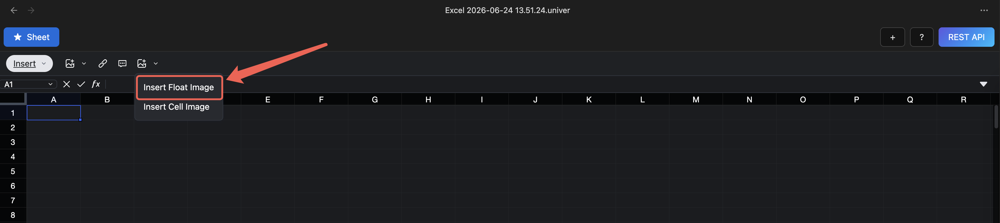

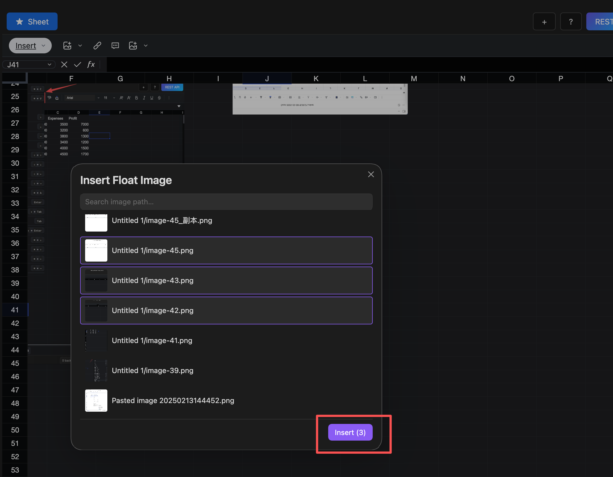

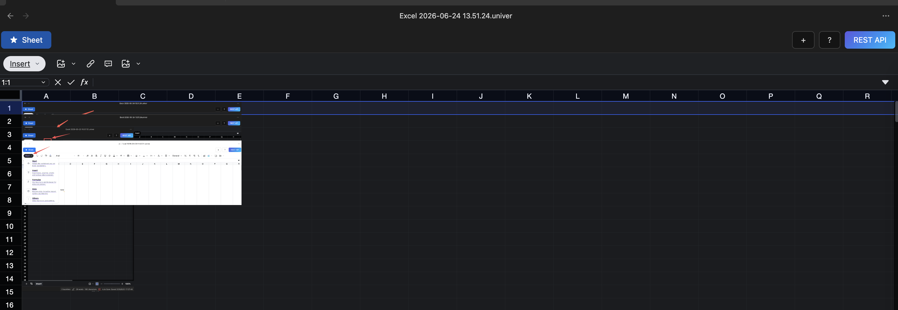

### Batch Insert Cell Images

Click the Insert Cell Image button, select multiple image files, and click the OK button to batch insert multiple cell images into the current column

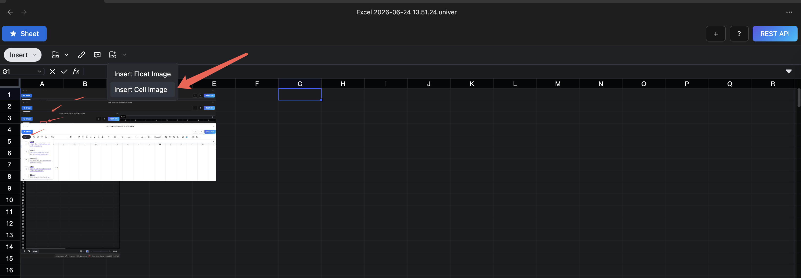

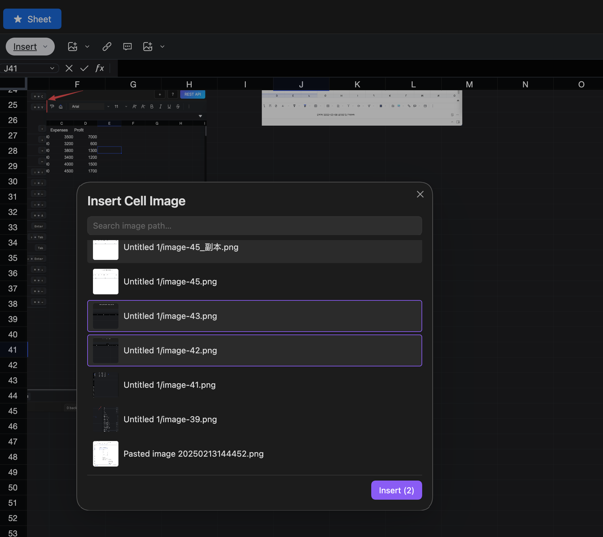

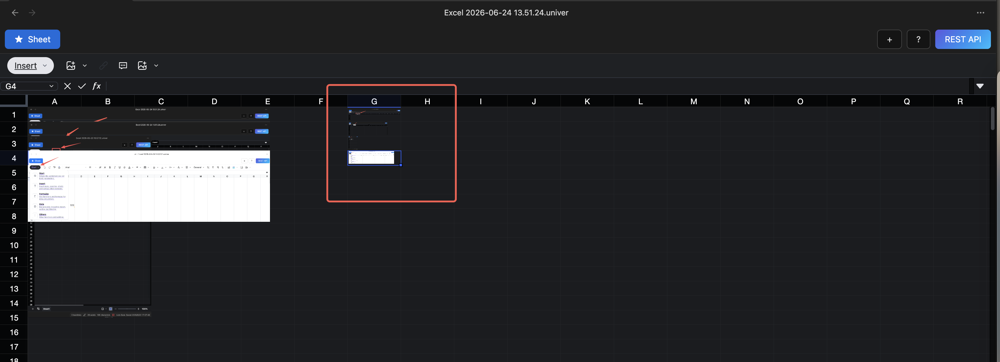