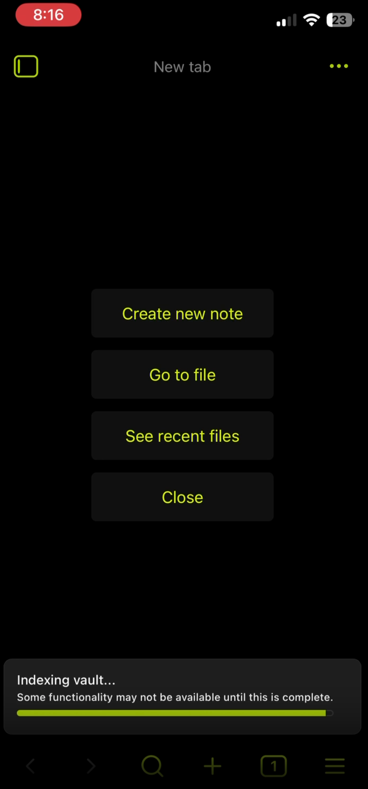
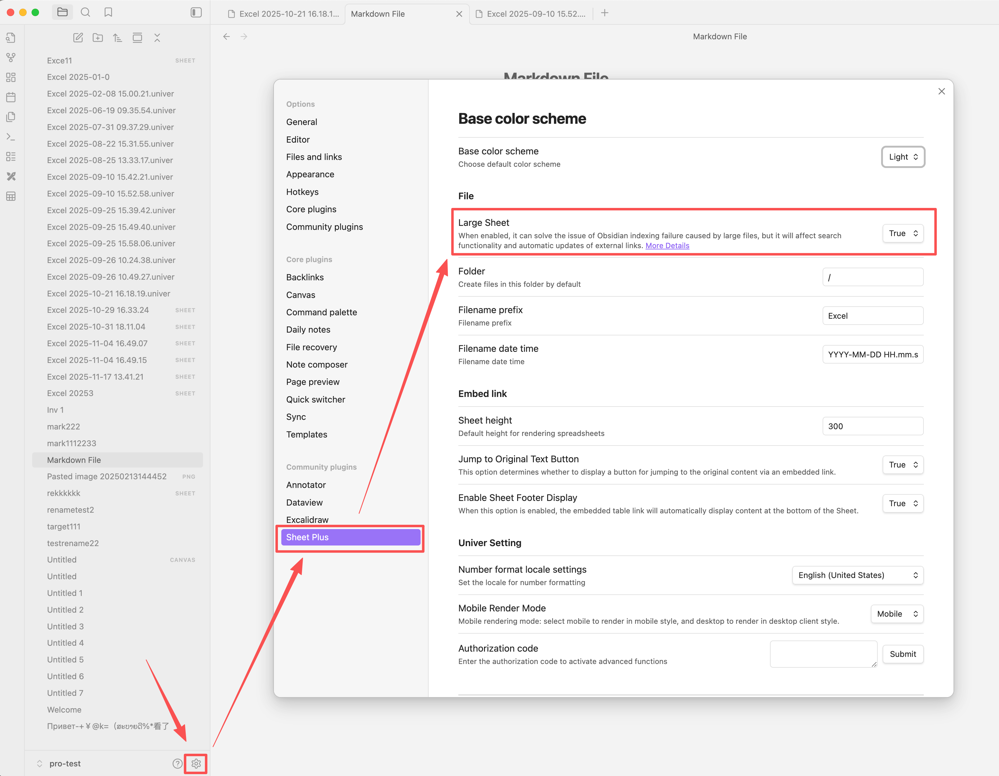

# Large Sheet

## About Large Sheet
- Regular Sheets use the `.md` file extension and are indexed by Obsidian. When a file becomes too large, it can cause Obsidian to index for a long time or even get stuck and fail to finish.
- To solve this problem, Sheet Plus provides the Large Sheet feature. Large Sheets use the `.sheet` file extension, are not indexed by Obsidian, and thus resolve the issue of prolonged indexing.

## Switch to Large Sheet Mode
Switch to the large sheet mode.

::: warning
*This will have the following effects:*
- When using Obsidian to search for content, it will not search the data within large sheets.
- When changing the name of an outgoing link file, the outgoing links in the table will not be automatically updated.
:::

