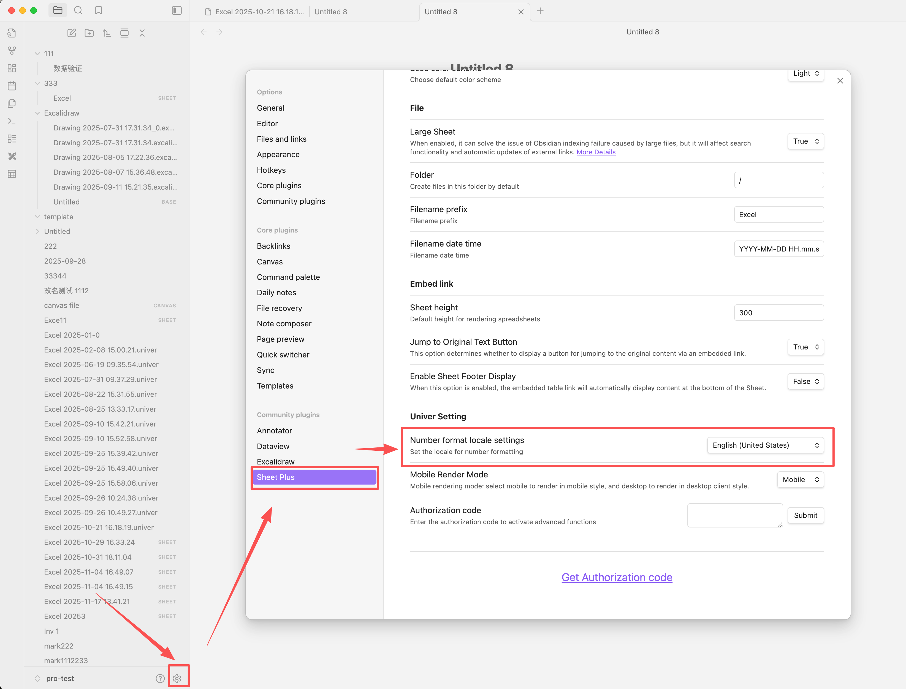

# Number Format Locale

Number formatting varies across different locales. You can switch between these formats using this setting.

```
// For example
1234567.89
1,234,567.89 // Chinese
1.234.567,89 // German
```

- Open Obsidian settings
- Locate **Sheet Plus** plugin settings
- Change Number Format Locale Settings
- Reopen the file for the changes to take effect

