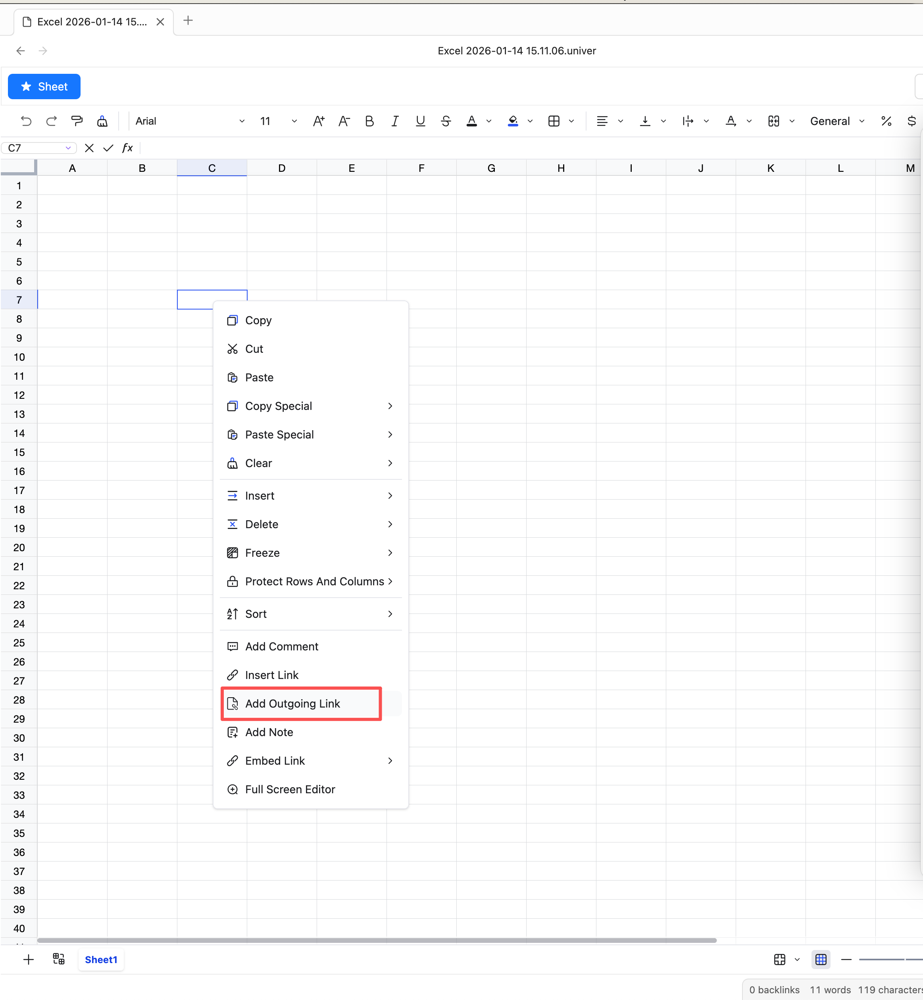
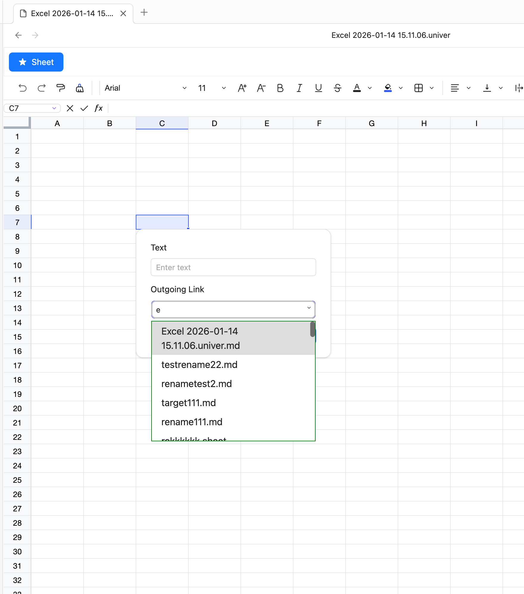
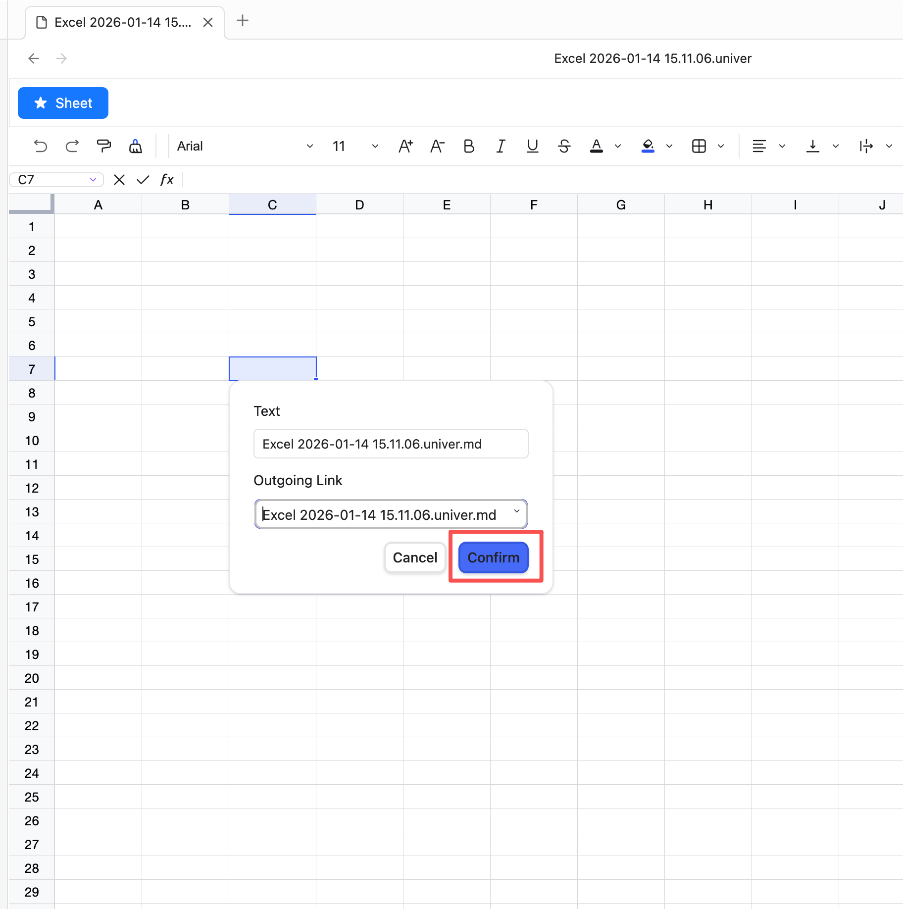
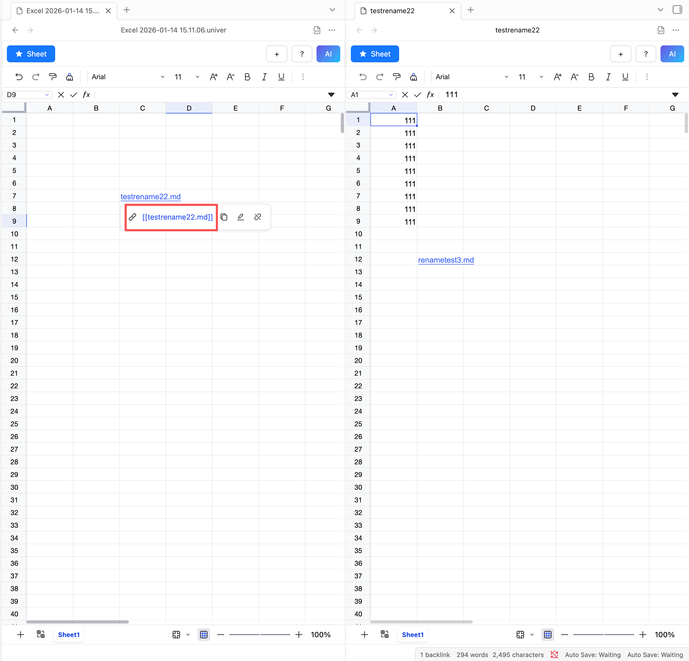

# Outgoing Link
## What is Outgoing Link?

Outgoing Link allows you to insert files from the current vault into a sheet via hyperlinks.

## How to use Outgoing Link?

1. Select the cell where you want to insert the link.
2. Right-click to open the context menu.
3. Choose "Add Outgoing Link" from the menu.

4. A dialog will appear with two input fields: Link Name and Link Address.
5. Click the address field and type to fuzzy-search the file you want to link.

6. Click OK to add the link.

7. Hover over the cell to see the link name; click the link to open the file on the right.

