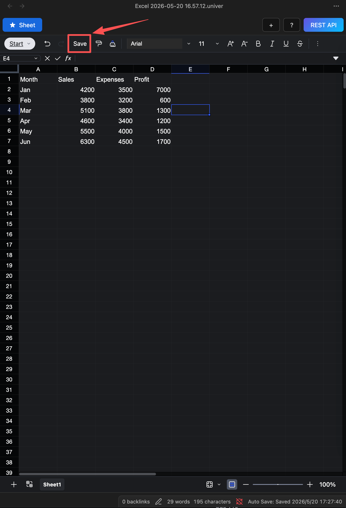

# Auto Save

After a table is modified, the data is not saved to the file immediately; instead, it is automatically saved every 30 seconds. You can check the save status in the status bar at the bottom.

::: note

- Closing the current file will immediately trigger a save, but closing Obsidian will result in the loss of unsaved data.
- For file recovery, please refer to the core plugin [File Recovery](https://help.obsidian.md/plugins/file-recovery) documentation
- When a file is opened for the first time, auto-save is triggered. If the file has not been modified and is deemed not needing to be saved, it will switch to the idle state.
:::

## Manual Save

To manually save the table, click the save button in the toolbar.

## Status Description

- Idle: The table has not been modified and is not saved.

- Waiting: The table has been modified and will be saved after 30 seconds.

- Saved: The table has been successfully saved, and the time of the last save is displayed.

