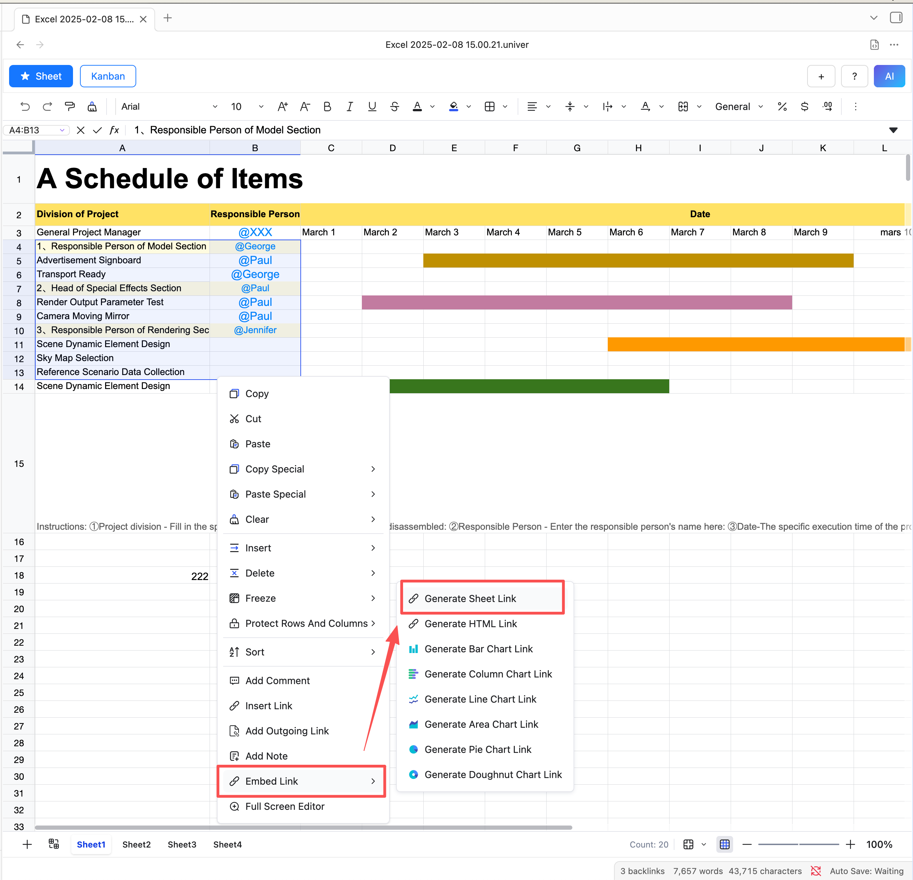
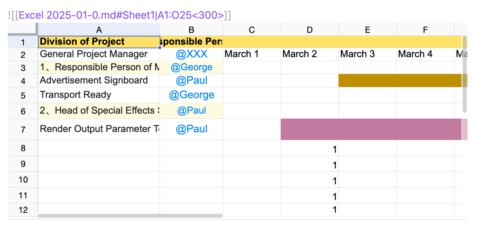
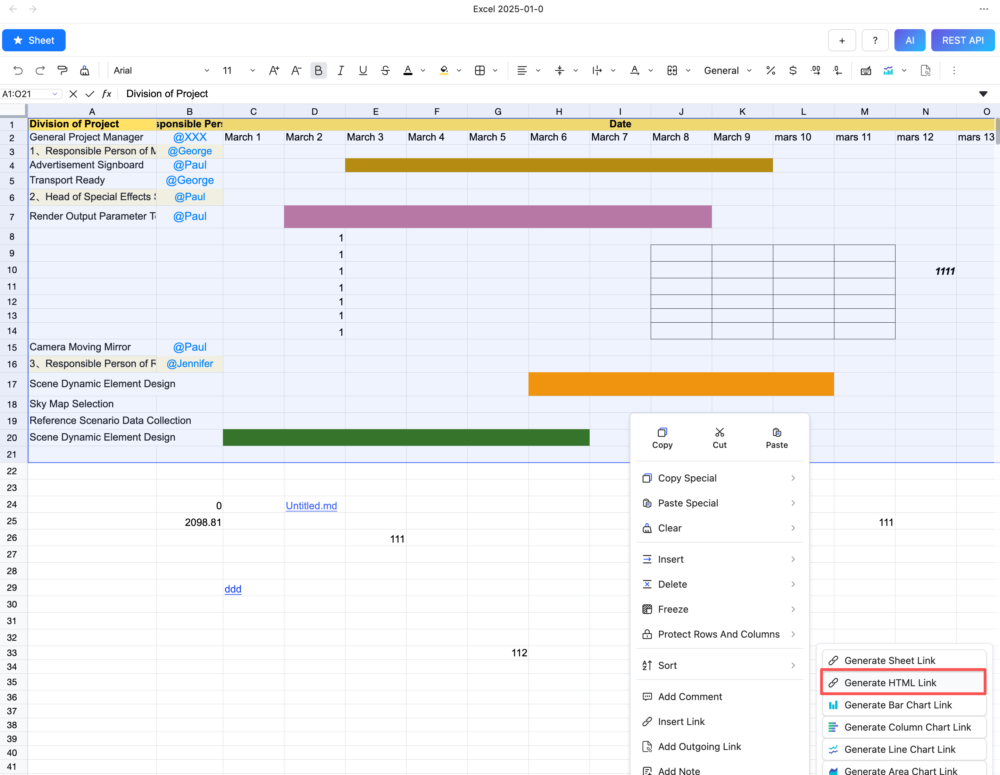
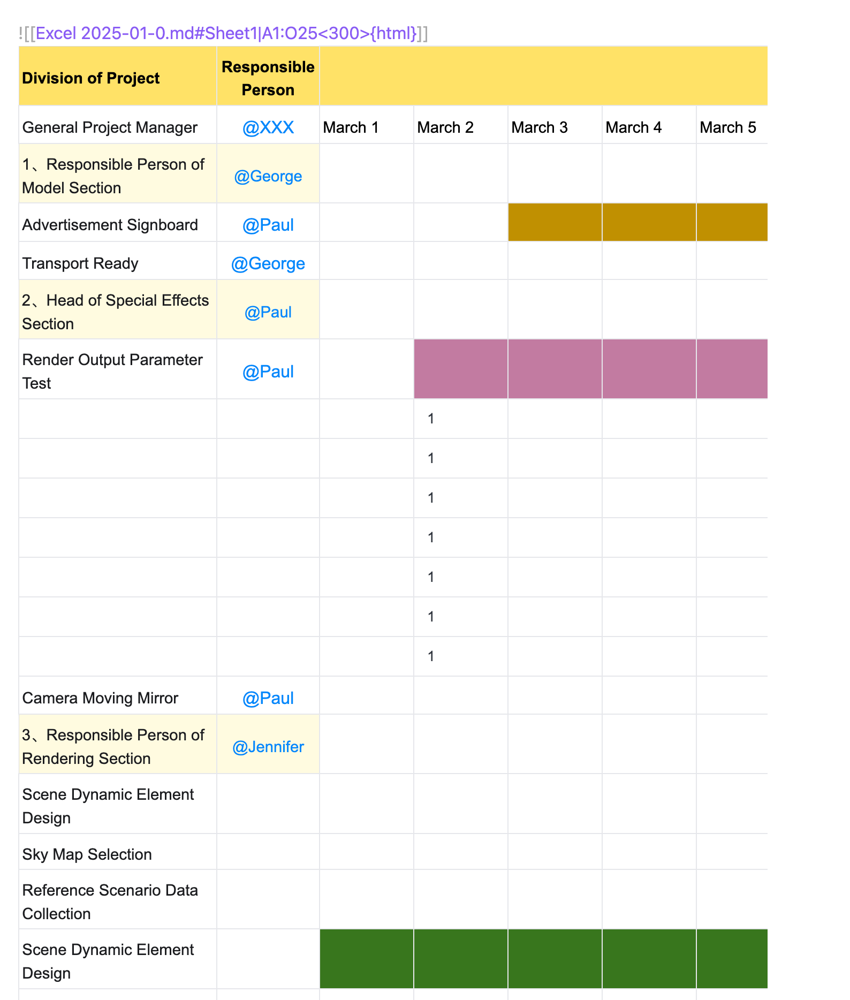
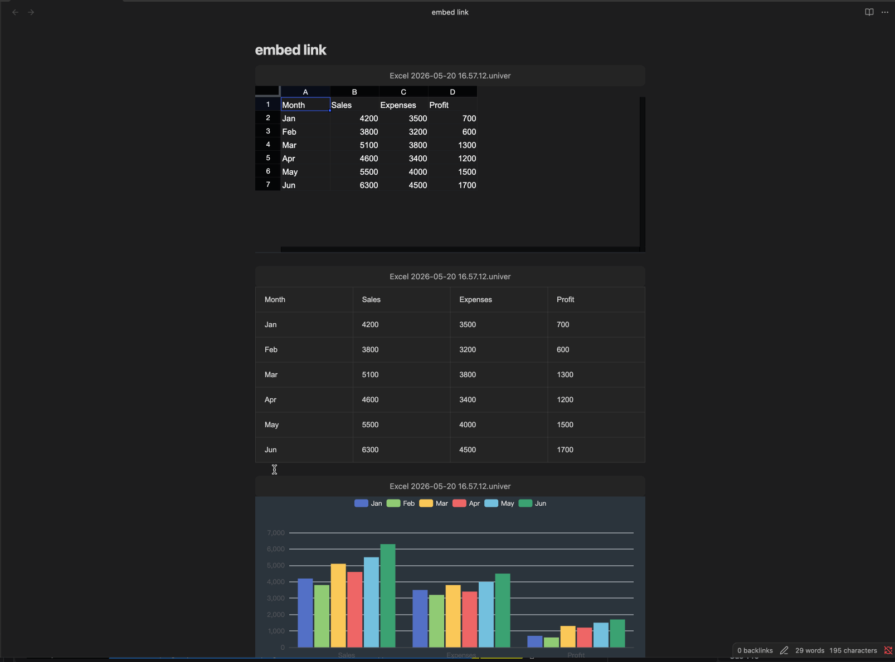

# Embed Sheet Link

## Generate a Sheet Embed Link

1. Select the data range
2. **Right-click inside the sheet**
3. Choose **`Embed Link`**
4. Click **`Generate Sheet Link`**

Sheet Plus will now generate a **sheet link** and copy it to your clipboard.



Preview:



## Generate HTML Embed Link

1. Select the data range
2. **Right-click inside the sheet**
3. Choose **`Embed Link`**
4. Click **`Generate HTML Link`**



Preview:



## Edit Embed Link

If you want to edit the content of an embedded link, click the jump button to open the sheet in the right split pane. After editing and saving, the embedded link will automatically refresh to reflect the changes.



## Embed Link Setting


## Height Rendering Modes

The embed link `![[sheet.md]]` supports two rendering modes, controlled in **Settings**:

| Mode | Behavior |
|------|----------|
| **Auto** | Height expands naturally based on the sheet content |
| **Custom** | Fixed height with scroll when content overflows |

**Explicit height `<500>` always takes priority** over both `auto` and `custom` modes. For example:

```
![[sheet.md|A1:D4<500>]]
```

This link will always render at `500px` height regardless of the global mode setting.

## Jump Button
- Show a jump button at the top of the embedded link. Default is `true`.


## Footer
- Toggle Sheet Footer Visibility of the embedded link. Default is `false`.

