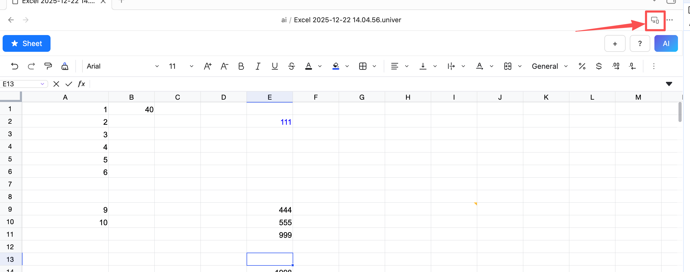

# Render Mode

## About Render Mode
- Mobile rendering to read-only mode to prevent the keyboard from popping up and blocking the visible area.
- If you need to edit content, you must manually switch to desktop mode.

## Quick Switch

  - mobile

  
  &nbsp;&nbsp;&nbsp;&nbsp;&nbsp;&nbsp;
  

  - desktop

  
