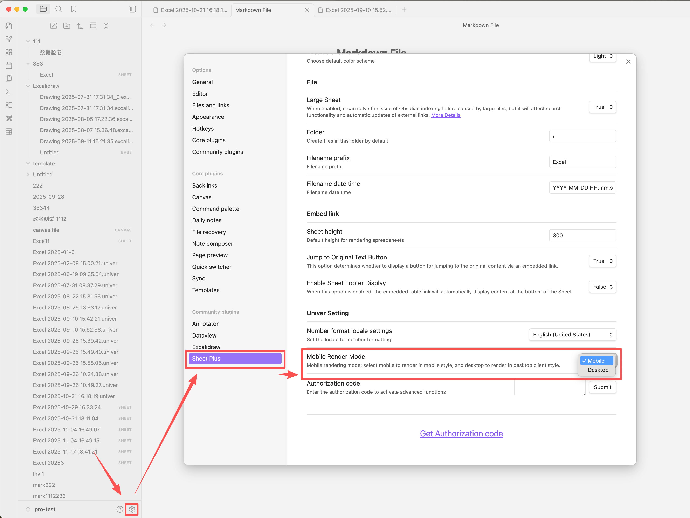
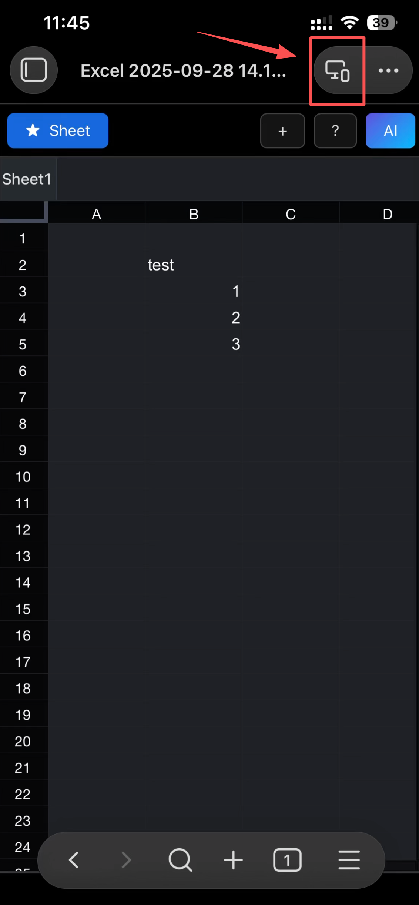
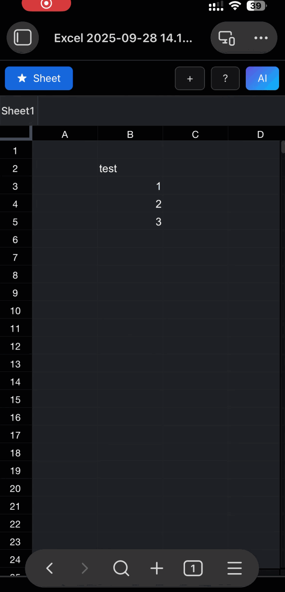
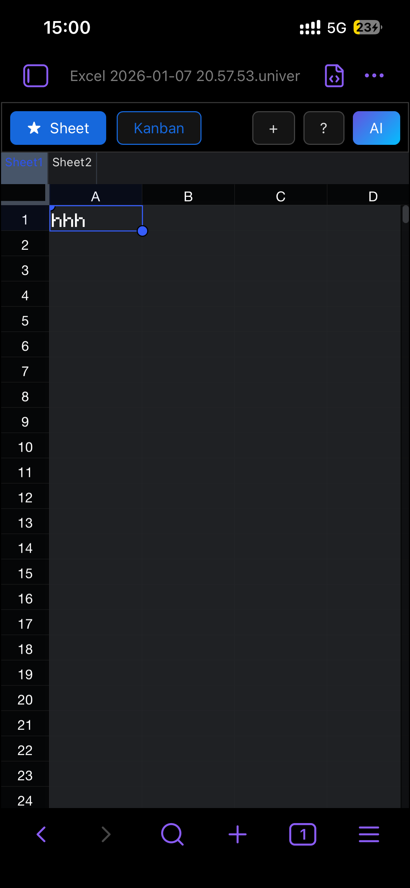
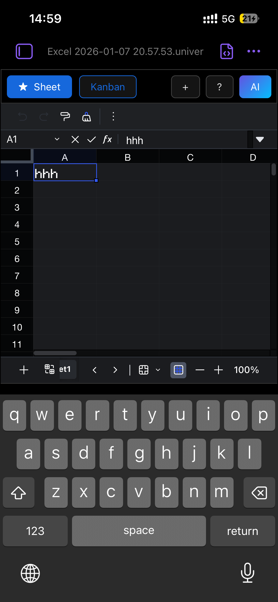

# Mobile Render Mode

## About Mobile Render Mode
- Mobile rendering defaults to read-only mode to prevent the keyboard from popping up and blocking the visible area.
- If you need to edit content, you must manually switch to desktop mode.

- Quick Switch

&nbsp;&nbsp;&nbsp;&nbsp;&nbsp;&nbsp;

- mobile mode

- desktop mode

