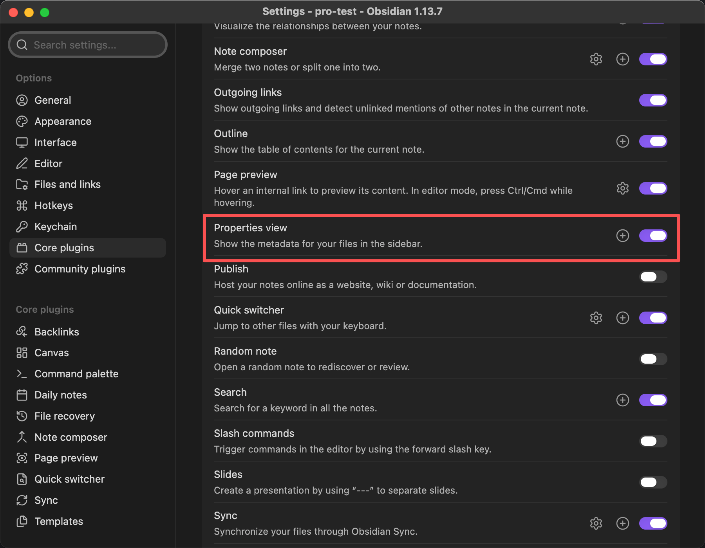
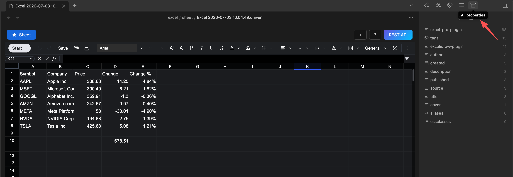
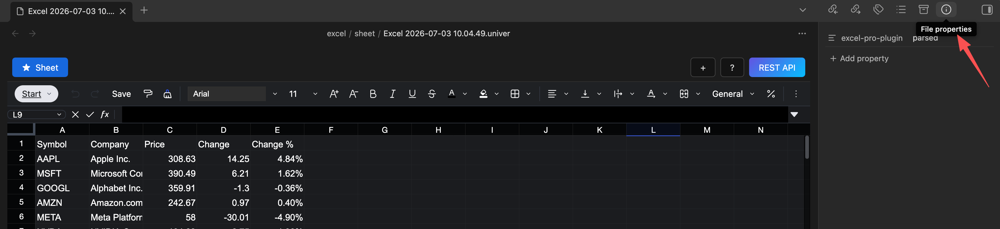

## Properties

How to Add Properties to a Table

Enable the Properties view in the core plugins

In the right sidebar, you will see an additional panel listing all properties

Press `Command + ;` to open the file properties panel
> On Windows, press `Ctrl + ;`

In this panel, you can add, delete, and modify properties

::: warning
The `excel-pro-plugin: parsed` property cannot be modified or deleted; otherwise, the table will not be parsed correctly
:::
