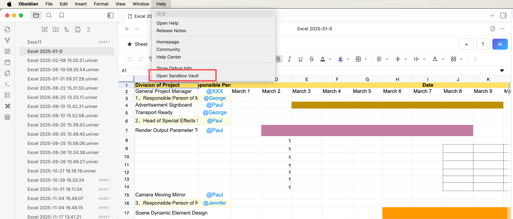
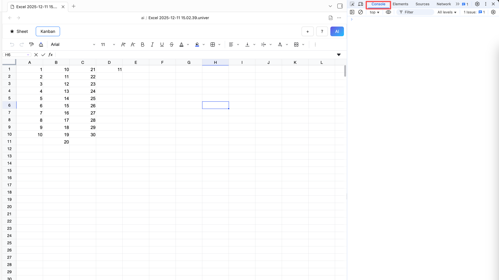
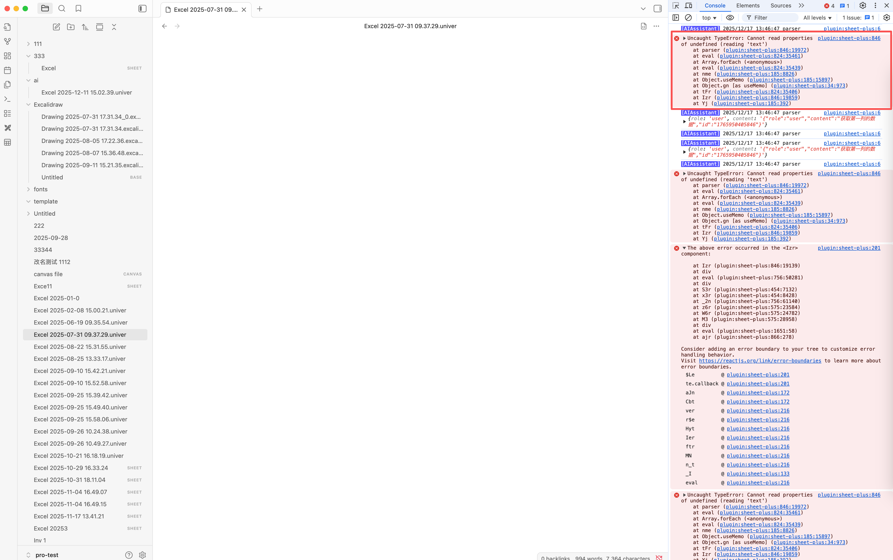

# How To Debug
## Step 1 - Check if the issue is caused by other plugins
- Enable sandbox mode and install only the Obsidian Sheet Plus plugin to see if the problem persists. If it does, proceed to the next step

## Step 2 - Use the debugging tools to troubleshoot
### Open the debugging tools
- **Windows Shortcut:** `Ctrl + Shift + I`
- **Mac Shortcut:** `Cmd + Option + I`
- **Linux Shortcut:** `Ctrl + Shift + I`

### Switch to the Console tab
- In the debugging tools, switch to the “Console” tab

### Review debugging information
- In the Console tab, check the debugging output from the plugin
- Look for any error messages or exceptions
- When reporting an issue, attach a screenshot of the error or exception

