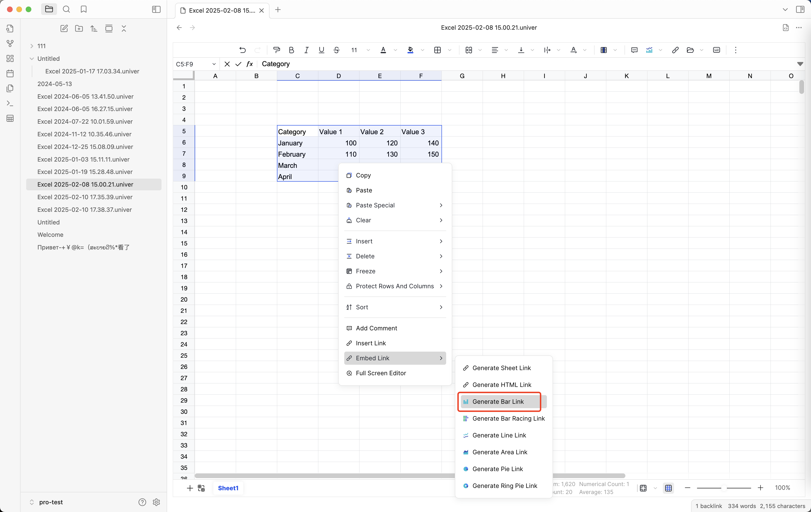
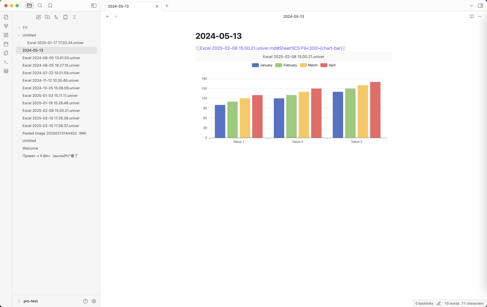

# Embed Chart Link <Badge text="License Required" type="warning" />

::: warning License Required
Embed Chart Link features are **available only after license activation**.
:::

This guide explains how to **embed a chart from Sheet Plus directly into your Markdown notes** using a chart link.

No screenshots assumed. No prior knowledge required.

## What is a Chart Link?

A **chart link** allows you to embed a chart generated from a spreadsheet **inside any Obsidian note**, just like an image or block embed.

This is useful when you want to:

* display charts next to written analysis
* reuse the same chart in multiple notes
* keep data and visualization connected

---

### 1️⃣ Create or Open a Spreadsheet

1. Open an existing spreadsheet in **Sheet Plus**, or create a new one
2. Make sure your data is ready for visualization

---

### 2️⃣ Generate a Chart Embed Link

1. Select the data range you want to visualize
2. Create or select a chart inside the spreadsheet
3. **Right-click inside the sheet**
4. Choose **`Embed Link`**
5. Click **`Generate Chart`**, choose the appropriate menu for different chart types

Sheet Plus will now generate a **chart embed link** and copy it to your clipboard.

> ℹ️ The chart link is generated via
> **Right-click → Embed Link → Generate Bar Link**



### 3️⃣ Embed the Chart in a Markdown Note

Open any Markdown note and paste the link using Obsidian embed syntax:

```md
![[your-chart-link]]
```

Once rendered, the chart will appear **directly inside the note**.

## Example

```md
![[Excel 2025-06-19 09.35.54.univer.md#Sheet1|B5:D10<300>{chart-bar}]]
```

The chart will stay in sync with the spreadsheet data.



## Key Behavior

* ✅ The embedded chart updates automatically when the data changes
* ✅ The same chart can be embedded in multiple notes
* ✅ The chart is read-only when embedded
* ⚠️ Editing the chart must be done inside the Sheet Plus spreadsheet

## Common Use Cases

Embedding charts works especially well for:

* Budget and expense reports
* Progress tracking
* Study or habit statistics
* Project dashboards
* Weekly / monthly summaries

---

## Troubleshooting

### The chart does not appear

* Make sure the chart still exists in the spreadsheet
* Verify the link was copied using **Embed Link**
* Confirm the plugin is enabled

### The chart is not updating

* Ensure the source spreadsheet was saved
* Reopen the note to refresh rendering

## Feedback

If you encounter issues or have suggestions:

* 🐛 Open a GitHub Issue
* 💬 Ask in Discord
* 📧 Email: [ljcoder@163.com](mailto:ljcoder@163.com)

Your feedback helps improve both documentation and features.