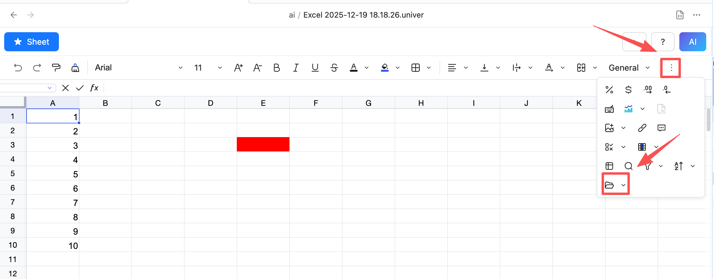
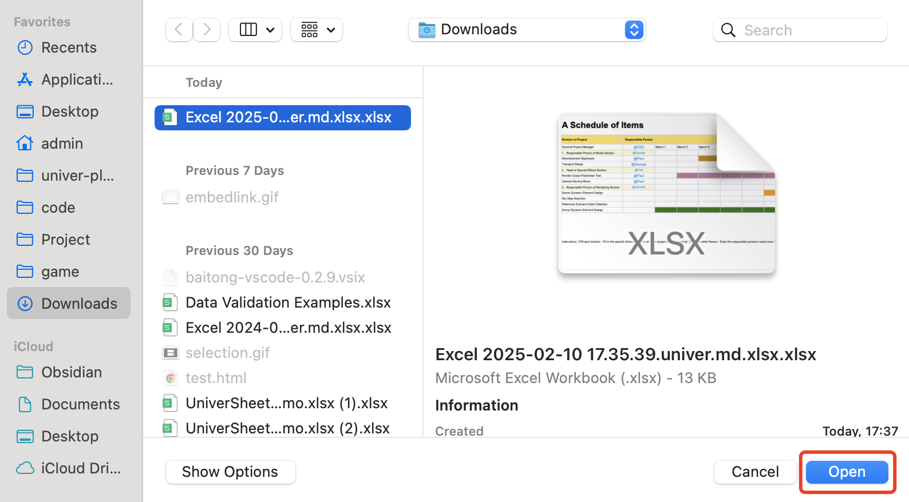
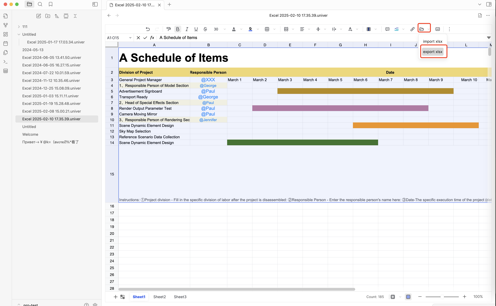
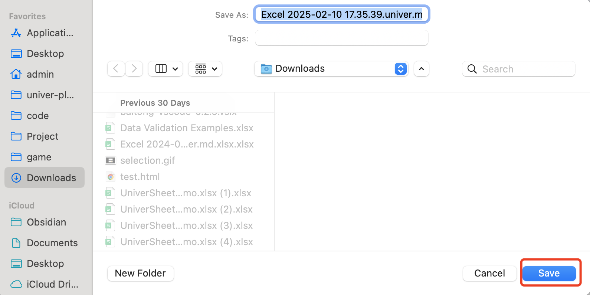

# Import & Export (Sheet Plus)<Badge text="License Required" type="warning" />

::: warning License Required
Import and Export features are **available only after license activation**.
:::

## Overview

Sheet Plus allows you to **import** external spreadsheet files and **export** your sheet data into common formats.

* 📥 Import Excel files
* 📤 Export data as Excel

## Importing Data

### Supported Formats

* `.xlsx`

---

### Step-by-Step: Import Data

#### Step 1 — Open a Sheet

- Click the import menu in the toolbar

> If you don't see the Import button, click the More button and you'll find the Import option in the drop-down menu.

---

#### Step 1 — Click Import

Select the file to import

## Exporting Data

---

### Step-by-Step: Export Data

#### Step 1 — Open the Sheet

Open the sheet you want to export.

---

#### Step 2 — Click Export

Click **Export** in the toolbar.

---

#### Step 3 — Save File

Choose a location and confirm export.

---

## License Requirement

> 🔐 **License Required**

Import & Export features are **disabled by default**.

To enable them:

1. Open **Settings → Sheet Plus**
2. Enter your **license code**
3. Restart Obsidian if required

Once activated, all Import & Export features will be unlocked.

## Troubleshooting

**Import / Export button is disabled**

* Make sure your license is activated
* Restart Obsidian after activation

## Feedback

* 💬 Discord
* 🐛 GitHub Issues
* 📧 Email: [ljcoder@163.com](mailto:ljcoder@163.com)
